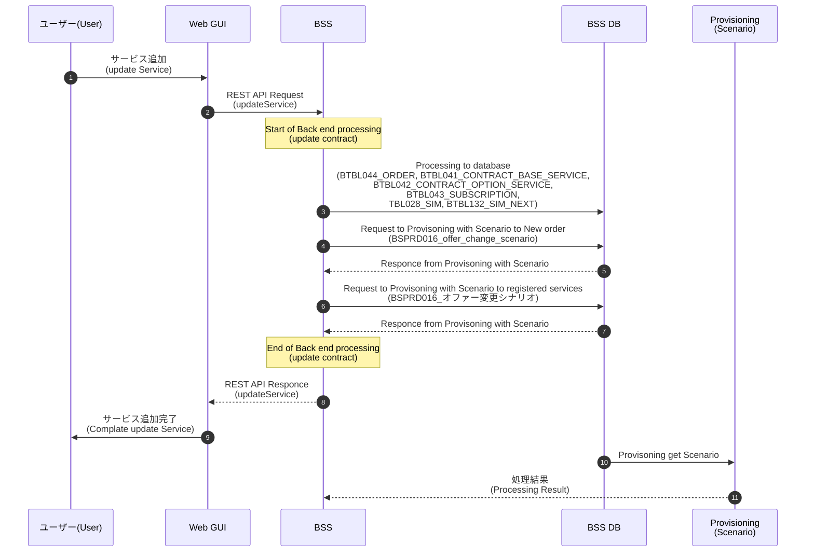

# サービス変更_サービス毎依頼(Update service)

# Newest information is written to section 9 on "BSS-OSS_detail_design_for_Service". Please see that document.(6/27)
## Currnt version on 6/27: 20220627_BSS-OSS_detail_design_for_Service_DraftF

## 概要(Summary)
指定したサービスの内容を設定する。(Set the content of the specified service.)
 

## 処理シーケンス(processing sequence)

* Update service per service

 

* Update service per subscription for release SIM

 

## 処理内容 (Processing details)

### **REST Name : updateService
* **PUT /api/service/{id}**
* AUTHORIZATIONS: (XsrfTokenCookie) OR (XsrfTokenHeader) OR (BearerAuth)

#### IN項目設定(IN item setting)
* path parameter
    | No. | 項目名     | Item name | BODY       | 型 (Data type) | 必須 (Mandatory) | Setting source | 設定値(parameter) | 備考 (Note) |
    | --- | ---------- | --------- | ---------- | -------------- | :--------------: | ----------------------- | ----------------- | ----------- |
    | 1   | サービスID |           | service_id | string         |        M         | Web FE                  | -                 |             |

* body parameter
    | No. | 項目名         | Item name | BODY                    | 型 (Data type) | 必須 (Mandatory) | Setting source | 設定値(parameter)    | 備考 (Note)                     |
    | --- | -------------- | --------- | ----------------------- | -------------- | :--------------: | ----------------------- | -------------------- | ----------------------------------------------------------------------------------------- |
    | 1   | 申込番号       |           | register_number         | string         |        O         | Web FE                  | -                    |    |
    | 2   | 更新予定日     |           | update_execution_date   | string         |        M         | Web FE                  | (service_start_date) | Use service_start_date          |
    | 3   | 登録Mode       |           | registration_mode       | integer        |        O         | Web FE                  | 0 (Default)          | If Null or not exist, use default value=0 (orverwrite).      |
    | 4   | サービス毎設定 |           | individual_service      | {}             |        O         | Web FE                  | -                    | Setting by services             |
    | 5   | 利用者毎設定   |           | individual_subscription | {}             |        O         | Web FE                  | -                    | Setting by subscriptions        |
    | 6   | SIM毎設定      |           | individual_sim          | {}             |        O         | Web FE                  | -                    | Setting by sims                 |
    | 7   | 注文ID         | order_id  | order_id                | string         |        O         | Web FE                  | -                    | When set order_id, update registered order. When not set or not exist, register new order |

     

    * individual_service {}
        | No. | 項目名                    | Item name | BODY                | 型 (Data type) | 必須 (Mandatory) | Setting source | 設定値(parameter) | 備考 (Note)                  |
        | --- | ------------------------- | --------- | ------------------- | -------------- | :--------------: | ----------------------- | ----------------- | ---------------------------- |
        | 1   | ベースサービス            |           | base_service_info   | {}             |        M         | Web FE                  | -                 | |
        | 2   | オプションサービス        |           | option_service_info | {}             |        O         | Web FE                  | -                 | When structure is not exist, |
        | 3   | Subscription stop release |           | subscription_ex     | {}             |        O         | -                       | -                 | |
        | 4   | SIMサービス共通           |           | sim_service_common  | {}             |        O         | Web FE                  | -                 | |
        | 5   | sim_bundle_setting        |           | sim_bundle_setting  | {}             |        O         | Web FE                  | -                 | |
         

      * base_service_info {}
          | No. | 項目名       | Item name | BODY              | 型 (Data type) | 必須 (Mandatory) | Setting source | 設定値(parameter) | 備考 (Note) |
          | --- | ------------ | --------- | ----------------- | -------------- | :--------------: | ----------------------- | ----------------- | ----------- |
          | 1   | サービス種別 |           | service_type_code | string         |        M         | Web FE                  | -                 |             |
          | 2   | 親サービスID |           | parent_service_id | string         |        O         | Web FE                  | -                 |             |
          | 3   | 関連サービス |           | associate_group   | string         |        O         | Web FE                  | -                 |             |
          | 4   | 料金プランID |           | bss_plan_ID       | integer        |        M         | Web FE                  | -                 |             |
          | 5   | 日付情報     |           | date_info         | {}             |        O         | Web FE                  | -                 |             |
          | 6   | 課金情報     |           | pricing_info      | {}             |        O         | Web FE                  | -                 |             |
          | 7   | 備考         |           | remark            | string         |        O         | Web FE                  | -                 |             |
           

        * date_info {}
            | No. | 項目名         | Item name | BODY               | 型 (Data type) | 必須 (Mandatory) | Setting source | 設定値(parameter) | 備考 (Note) |
            | --- | -------------- | --------- | ------------------ | -------------- | :--------------: | ----------------------- | ----------------- | ----------- |
            | 1   | サービス開始日 |           | service_start_date | string         |        M         | Web FE                  | -                 |             |
            | 2   | 請求開始日     |           | billing_start_date | string         |        M         | Web FE                  | -                 |             |
            | 3   | 請求終了日     |           | billing_end_date   | string         |        O         | Web FE                  | -                 |             |
            | 4   | サービス終了日 |           | service_end_date   | string         |        O         | Web FE                  | -                 |             |
           

        * pricing_info {}
            | No. | 項目名       | Item name | BODY             | 型 (Data type) | 必須 (Mandatory) | Setting source | 設定値(parameter) | 備考 (Note) |
            | --- | ------------ | --------- | ---------------- | -------------- | :--------------: | ----------------------- | ----------------- | ----------- |
            | 1   | 基本料金値引 |           | price_discount   | string         |        O         | Web FE                  | -                 |             |
            | 2   | 調整金       |           | adjustment_money | string         |        O         | Web FE                  | -                 |             |
           

      * option_service_info [] *return only active options*
          | No. | 項目名         | Item name | BODY              | 型 (Data type) | 必須 (Mandatory) | Setting source | 設定値(parameter) | 備考 (Note)  |
          | --- | -------------- | --------- | ----------------- | -------------- | :--------------: | ----------------------- | ----------------- | ---------------------------------------------------------------------- |
          | 1   | サービス明細ID |           | service_detail_id | number         |        M         | Web FE                  | -                 | 設定値=[2]-[21] Optionは最大20個( Set value = [2]-[21] Option max. 20) |
          | 2   | 料金プランID   |           | bss_plan_ID       | number         |        M         | Web FE                  | -                 | Subscriptionに紐付く                      |
          | 3   | 基本料金値引   |           | price_discount    | number         |        O         | Web FE                  | -                 |              |
          | 4   | 数量           |           | number            | integer        |        O         | Web FE                  | -                 | For other than sim service                |
          | 5   | 有効設定       | Is enable | is_enable         | integer        |        O         | Web FE                  |                   | 0=disable, 1=enable                       |
           

      * subscription_ex {}
          | No. | 項目名                    | Item name | BODY                 | Data type | Mandatory | Setting source | parameter | 備考 (Note)                          |
          | --- | ------------------------- | --------- | -------------------- | --------- | :-------: | -------------- | --------- | ----------------------------------------------------------------- |
          | 1   | Subscription stop         |           | subscription_stop    | string    |     O     | BSS generate   | 0 or 1    | When will stop SIM, set "1". When Not it set "0"                  |
          | 2   | Subscription release      |           | subscription_release | string    |     O     | BSS generate   | 0 or 1    | When will release SIM, set "1". When Not it set "0"               |
          | 3   | release delivery_agent_id |           | r_delivery_agent_id  | integer   |     O     | Web GUI        | -         | When null or blank or not exist, use TBL028_SIM.delivery_agent_id |
           

      * sim_service_common {}
          | No. | 項目名            | Item name | BODY                     | 型 (Data type) | 必須 (Mandatory) | Setting source | 設定値(parameter) | 備考 (Note) |
          | --- | ----------------- | --------- | ------------------------ | -------------- | :--------------: | ----------------------- | ----------------- | ----------- |
          | 1   | シェアフラグ      |           | share_flag               | boolean        |        M         | Web FE                  | -                 | "share_flag" is conditional mandatory. if "sim_service_common" is used,  "share_flag" is mandatory. (eg, SIM service)   But when "sim_service_common" is not use, "share_flag" is also not use (option). |
          | 2   | シェア単金値引    |           | share_unit_discount      | string         |        O         | Web FE                  | -                 |             |
          | 3   | 従量単金値引      |           | incurred_unit_discount   | string         |        O         | Web FE                  | -                 |             |
          | 4   | 2段階従量単金値引 |           | inc_second_unit_discount | string         |        O         | Web FE                  | -                 |             |
          | 5   | チャージ単金値引  |           | charge_discount          | string         |        O         | Web FE                  | -                 |             |
           

      * SIM_bundle_setting {}
          | No. | 項目名      | Item name  | BODY              | 型 (Data type) | 必須 (Mandatory) | Setting source | 設定値(parameter) | 備考 (Note) |
          | --- | ----------- | ---------- | ----------------- | -------------- | :--------------: | ----------------------- | ----------------- | ----------- |
          | 1   | SIM情報     |            | sim_info          | {}             |        M         | Web FE                  | -                 |             |
          | 2   | SIM APN情報 |            | sim_apn_info      | {}             |        O         | Web FE                  | -                 |             |
          | 3   | SIM status  | SIM status | SIM status        | integer        |        O         | Web FE                  | -                 |             |
           

        * sim_info {}
            | No. | 項目名    | Item name | BODY           | 型 (Data type) | 必須 (Mandatory) | Setting source | 設定値(parameter) | 備考 (Note) |
            | --- | --------- | --------- | -------------- | -------------- | :--------------: | ----------------------- | ----------------- | ----------- |
            | 1   | SIM種別   |           | sim_type       | integer        |        O         | Web FE                  | -                 |             |
            | 2   | SIMサイズ |           | sim_size       | integer        |        M         | Web FE                  | -                 |             |
            | 3   | SIM世代   |           | sim_generation | integer        |        M         | Web FE                  | -                 |             |
             

        * sim_apn_info {}
            | No. | 項目名           | Item name | BODY             | Data type | 必須 (Mandatory) | Setting source | 設定値(parameter) | 備考 (Note) |
            | --- | ---------------- | --------- | ---------------- | --------- | :--------------: | ----------------------- | ----------------- | ----------- |
            | 1   | apn_id           |           | apn_id           | integer   |        O         | Web GUI                 | -                 |             |
            | 2   | apn_user_ID      |           | apn_user_ID      | string    |        O         | Web GUI                 | -                 |             |
            | 3   | apn_user_PW      |           | apn_user_PW      | string    |        O         | Web GUI                 | -                 |             |
            | 4   | fixed_ip_address |           | fixed_ip_address | string    |        O         | Web GUI                 | -                 |             |
            | 5   | dns_primary      |           | dns_primary      | string    |        O         | Web GUI                 | -                 |             |
            | 6   | dns_secondary    |           | dns_secondary    | string    |        O         | Web GUI                 | -                 |             |
             

    * individual_subscription {}
        | No. | 項目名          | Item name | BODY             | 型 (Data type) | 必須 (Mandatory) | Setting source | 設定値(parameter) | 備考 (Note) |
        | --- | --------------- | --------- | ---------------- | -------------- | :--------------: | ----------------------- | ----------------- | ----------- |
        | 1   | subscription_id |           | subscription_id  | integer        |        M         | Web GUI                 | -                 |             |
        | 2   | 利用者毎設定    |           | per_subscription | {}             |        O         | -                       | -                 |             |
         

      * per_subscription {}
          | No. | 項目名                    | Item name | BODY                | 型 (Data type) | 必須 (Mandatory) | Setting source | 設定値(parameter) | 備考 (Note) |
          | --- | ------------------------- | --------- | ------------------- | -------------- | :--------------: | ----------------------- | ----------------- | ----------- |
          | 1   | ベースサービス            |           | base_service_info   | {}             |        O         | -                       | -                 |             |
          | 2   | オプションサービス        |           | option_service_info | []             |        O         | -                       | -                 |             |
          | 3   | Subscription stop release |           | subscription_ex     | {}             |        O         | -                       | -                 |             |
          | 4   | SIMサービス共通           |           | sim_service_common  | {}             |        O         | -                       | -                 |             |
          | 5   | SIM毎設定                 |           | individual_sim      | []             |        O         | -                       | -                 |             |
           

          * base_service_info {}
              | No. | 項目名       | Item name | BODY              | 型 (Data type) | 必須 (Mandatory) | Setting source | 設定値(parameter) | 備考 (Note) |
              | --- | ------------ | --------- | ----------------- | -------------- | :--------------: | ----------------------- | ----------------- | ----------- |
              | 1   | サービス種別 |           | service_type_code | string         |        M         | Web GUI                 | -                 |             |
              | 2   | 親サービスID |           | parent_service_id | string         |        O         | Web GUI                 | -                 |             |
              | 3   | 関連サービス |           | associate_group   | string         |        O         | Web GUI                 | -                 |             |
              | 4   | 料金プランID |           | bss_plan_ID       | integer        |        M         | Web GUI                 | -                 |             |
              | 5   | 日付情報     |           | date_info         | {}             |        O         | -                       | -                 |             |
              | 6   | 課金情報     |           | pricing_info      | {}             |        O         | -                       | -                 |             |
              | 7   | 備考         |           | remark            | string         |        O         | Web GUI                 | -                 |             |
               

            * date_info {}
                | No. | 項目名                   | Item name | BODY               | 型 (Data type) | 必須 (Mandatory) | Setting source       | 設定値(parameter)    | 備考 (Note) |
                | --- | ------------------------ | --------- | ------------------ | -------------- | :--------------: | ----------------------------- | -------------------- | ----------- |
                | 1   | サブスクリプション更新日 |           | update_excution_date | string         |        O         | Web GUI                 | update_excution_date |             |
                | 2   | サービス開始日           |           | service_start_date | string         |        M         | Web GUI                 | service_start_date   |             |
                | 3   | 請求開始日               |           | billing_start_date | string         |        M         | Web GUI                 | billing_start_date   |             |
                | 4   | 請求終了日               |           | billing_end_date   | string         |        O         | Web GUI                 | billing_end_date     |             |
                | 5   | サービス終了日           |           | service_end_date   | string         |        O         | Web GUI                 | service_end_date     |             |
               

            * pricing_info {}
                | No. | 項目名       | Item name | BODY             | 型 (Data type) | 必須 (Mandatory) | Setting source | 設定値(parameter) | 備考 (Note) |
                | --- | ------------ | --------- | ---------------- | -------------- | :--------------: | ----------------------- | ----------------- | ----------- |
                | 1   | 基本料金値引 |           | price_discount   | string         |        O         | Web GUI                 | -                 |             |
                | 2   | 調整金       |           | adjustment_money | string         |        O         | Web GUI                 | -                 |             |
               
        

          * option_service_info {} *return only active options*
              | No. | 項目名         | Item name | BODY              | 型 (Data type) | 必須 (Mandatory) | Setting source | 設定値(parameter) | 備考 (Note)         |
              | --- | -------------- | --------- | ----------------- | -------------- | :--------------: | ----------------------- | ----------------- | ------------------- |
              | 1   | サービス明細ID |           | service_detail_id | number         |        M         | Web GUI                 | -                 |                     |
              | 2   | 料金プランID   |           | bss_plan_ID       | number         |        M         | Web GUI                 | -                 |                     |
              | 3   | 基本料金値引   |           | price_discount    | number         |        O         | Web GUI                 | -                 |                     |
              | 4   | 有効設定       | Is enable | is_enable         | integer        |        O         | Web GUI                 |                   | 0=disable, 1=enable |
               

          * subscription_ex {}
              | No. | 項目名                    | Item name | BODY                 | Data type | Mandatory | Setting source | parameter | 備考 (Note)                          |
              | --- | ------------------------- | --------- | -------------------- | --------- | :-------: | -------------- | --------- | ----------------------------------------------------------------- |
              | 1   | Subscription stop         |           | subscription_stop    | string    |     O     | Web GUI        | 0 or 1    | When will stop SIM, set "1". When Not it set "0"                  |
              | 2   | Subscription release      |           | subscription_release | string    |     O     | Web GUI        | 0 or 1    | When will release SIM, set "1". When Not it set "0"               |
              | 3   | release delivery_agent_id |           | r_delivery_agent_id  | integer   |     O     | Web GUI        | -         | When null or blank or not exist, use TBL028_SIM.delivery_agent_id |
               

          * sim_service_common {}
              | No. | 項目名            | Item name | BODY                     | 型 (Data type) | 必須 (Mandatory) | Setting source | 設定値(parameter) | 備考 (Note) |
              | --- | ----------------- | --------- | ------------------------ | -------------- | :--------------: | ----------------------- | ----------------- | ----------- |
              | 1   | シェアフラグ      |           | share_flag               | integer        |        M         | Web GUI                 | -                 | "share_flag" is conditional mandatory. if "sim_service_common" is used,  "share_flag" is mandatory. (eg, SIM service)   But when "sim_service_common" is not use, "share_flag" is also not use (option). |
              | 2   | シェア単金値引    |           | share_unit_discount      | string         |        O         | Web GUI                 | -                 |             |
              | 3   | 従量単金値引      |           | incurred_unit_discount   | string         |        O         | Web GUI                 | -                 |             |
              | 4   | 2段階従量単金値引 |           | inc_second_unit_discount | string         |        O         | Web GUI                 | -                 |             |
              | 5   | チャージ単金値引  |           | charge_discount          | string         |        O         | Web GUI                 | -                 |             |
               

          * individual_sim {}
              | No. | 項目名    | Item name | BODY    | 型 (Data type) | 必須 (Mandatory) | Setting source | 設定値(parameter) | 備考 (Note) |
              | --- | --------- | --------- | ------- | -------------- | :--------------: | ----------------------- | ----------------- | ----------- |
              | 1   | SIM ID    |           | SIM_ID  | integer        |        O         | Web GUI                 | -                 |             |
              | 2   | SIM毎設定 |           | per_sim | {}             |        O         | -                       | -                 |             |
               

            * per_sim {}
                | No. | 項目名          | Item name  | BODY              | 型 (Data type) | 必須 (Mandatory) | Setting source | 設定値(parameter) | 備考 (Note) |
                | --- | --------------- | ---------- | ----------------- | -------------- | :--------------: | ----------------------- | ----------------- | ----------- |
                | 1   | SIM情報         |            | sim_info          | {}             |        O         | Web GUI                 | -                 |             |
                | 2   | SIM配送         |            | sim_delivery_info | {}             |        O         | Web GUI                 | -                 |             |
                | 3   | SIM APN情報     |            | sim_apn_info      | {}             |        O         | Web GUI                 | -                 |             |
                | 4   | 他社SIM番号情報 |            | sim_number_info   | {}             |        O         | Web GUI                 | -                 |             |
                | 5   | SIM status      | SIM status | SIM status        | integer        |        O         | Web GUI                 | -                 |             |

              * sim_info {}
                  | No. | 項目名    | Item name | BODY           | 型 (Data type) | 必須 (Mandatory) | Setting source | 設定値(parameter) | 備考 (Note) |
                  | --- | --------- | --------- | -------------- | -------------- | :--------------: | ----------------------- | ----------------- | ----------- |
                  | 1   | SIM種別   |           | sim_type       | integer        |        O         | Web GUI                 | -                 |             |
                  | 2   | SIMサイズ |           | sim_size       | integer        |        M         | Web GUI                 | -                 |             |
                  | 3   | SIM世代   |           | sim_generation | integer        |        M         | Web GUI                 | -                 |             |
                   

              * sim_delivery_info {}
                  | No. | 項目名         | Item name | BODY                           | 型 (Data type) | 必須 (Mandatory) | Setting source | 設定値(parameter) | 備考 (Note) |
                  | --- | -------------- | --------- | ------------------------------ | -------------- | :--------------: | ----------------------- | ----------------- | ----------- |
                  | 1   | 依頼主コード   |           | simClientCode                  | string         |        O         | Web GUI                 | -                 |             |
                  | 2   | 配送業者ID     |           | delivery_agent_id              | integer        |        O         | Web GUI                 | -                 |             |
                  | 3   | 配送希望日     |           | delivery_date                  | string         |        O         | Web GUI                 | -                 |             |
                  | 4   | 配送希望時間帯 |           | delivery_preferred_timezone_id | integer        |        O         | Web GUI                 | -                 |             |
                  | 5   | 配送先住所ID   |           | address_id                     | integer        |        O         | Web GUI                 | -                 |             |
                   

              * sim_apn_info {}
                  | No. | 項目名           | Item name | BODY             | Data type | 必須 (Mandatory) | Setting source | 設定値(parameter) | 備考 (Note) |
                  | --- | ---------------- | --------- | ---------------- | --------- | :--------------: | ----------------------- | ----------------- | ----------- |
                  | 1   | apn_id           |           | apn_id           | integer   |        O         | Web GUI                 | -                 |             |
                  | 2   | apn_user_ID      |           | apn_user_ID      | string    |        O         | Web GUI                 | -                 |             |
                  | 3   | apn_user_PW      |           | apn_user_PW      | string    |        O         | Web GUI                 | -                 |             |
                  | 4   | fixed_ip_address |           | fixed_ip_address | string    |        O         | Web GUI                 | -                 |             |
                  | 5   | dns_primary      |           | dns_primary      | string    |        O         | Web GUI                 | -                 |             |
                  | 6   | dns_secondary    |           | dns_secondary    | string    |        O         | Web GUI                 | -                 |             |
                   

              * sim_number_info {}
                  | No. | 項目名 | Item name | BODY   | Data type | 必須 (Mandatory) | Setting source | 設定値(parameter) | 備考 (Note) |
                  | --- | ------ | --------- | ------ | --------- | :--------------: | ----------------------- | ----------------- | ----------- |
                  | 1   | MSISDN |           | MSISDN | string    |        O         | Web GUI                 | -                 |             |
                  | 2   | IMSI   |           | IMSI   | string    |        O         | Web GUI                 | -                 |             |
                  | 3   | ICCID  |           | ICCID  | string    |        O         | Web GUI                 | -                 |             |
                   

  * individual_sim {}
      | No. | 項目名    | Item name | BODY    | 型 (Data type) | 必須 (Mandatory) | Setting source | 設定値(parameter) | 備考 (Note) |
      | --- | --------- | --------- | ------- | -------------- | :--------------: | ----------------------- | ----------------- | ----------- |
      | 1   | SIM ID    |           | SIM_ID  | integer        |        O         | Web GUI                 | -                 |             |
      | 2   | SIM毎設定 |           | per_sim | {}             |        O         | -                       | -                 |             |
       

    * per_sim {}
        | No. | 項目名          | Item name  | BODY              | 型 (Data type) | 必須 (Mandatory) | Setting source | 設定値(parameter) | 備考 (Note) |
        | --- | --------------- | ---------- | ----------------- | -------------- | :--------------: | ----------------------- | ----------------- | ----------- |
        | 1   | SIM情報         |            | sim_info          | {}             |        O         | Web GUI                 | -                 |             |
        | 2   | SIM APN情報     |            | sim_apn_info      | {}             |        O         | Web GUI                 | -                 |             |
        | 3   | 他社SIM番号情報 |            | sim_number_info   | {}             |        O         | Web GUI                 | -                 |             |
        | 4   | SIM status      | SIM status | SIM status        | integer        |        O         | Web GUI                 | -                 |             |
         

      * sim_info {}
          | No. | 項目名    | Item name | BODY           | 型 (Data type) | 必須 (Mandatory) | Setting source | 設定値(parameter) | 備考 (Note) |
          | --- | --------- | --------- | -------------- | -------------- | :--------------: | ----------------------- | ----------------- | ----------- |
          | 1   | SIM種別   |           | sim_type       | integer        |        O         | Web GUI                 | -                 |             |
          | 2   | SIMサイズ |           | sim_size       | integer        |        M         | Web GUI                 | -                 |             |
          | 3   | SIM世代   |           | sim_generation | integer        |        M         | Web GUI                 | -                 |             |
           

      * sim_apn_info {}
          | No. | 項目名           | Item name | BODY             | Data type | 必須 (Mandatory) | Setting source | 設定値(parameter) | 備考 (Note) |
          | --- | ---------------- | --------- | ---------------- | --------- | :--------------: | ----------------------- | ----------------- | ----------- |
          | 1   | apn_id           |           | apn_id           | integer   |        O         | Web GUI                 | -                 |             |
          | 2   | apn_user_ID      |           | apn_user_ID      | string    |        O         | Web GUI                 | -                 |             |
          | 3   | apn_user_PW      |           | apn_user_PW      | string    |        O         | Web GUI                 | -                 |             |
          | 4   | fixed_ip_address |           | fixed_ip_address | string    |        O         | Web GUI                 | -                 |             |
          | 5   | dns_primary      |           | dns_primary      | string    |        O         | Web GUI                 | -                 |             |
          | 6   | dns_secondary    |           | dns_secondary    | string    |        O         | Web GUI                 | -                 |             |
           

      * sim_number_info {}
          | No. | 項目名 | Item name | BODY   | Data type | 必須 (Mandatory) | Setting source | 設定値(parameter) | 備考 (Note) |
          | --- | ------ | --------- | ------ | --------- | :--------------: | ----------------------- | ----------------- | ----------- |
          | 1   | MSISDN |           | MSISDN | string    |        O         | Web GUI                 | -                 |             |
          | 2   | IMSI   |           | IMSI   | string    |        O         | Web GUI                 | -                 |             |
          | 3   | ICCID  |           | ICCID  | string    |        O         | Web GUI                 | -                 |             |
           

#### OUT項目(OUT item setting)
* 200 -  Service更新成功(Successful service update)
    | No. | 項目名 | Item name | BODY    | 型 (Data type) | 必須 (Mandatory) | Setting source | 設定値 (parameter) | 備考 (Note) |
    | --- | ------ | --------- | ------- | -------------- | :--------------: | ----------------------- | ------------------ | ----------- |
    | 1   | 状態   | Status    | status  | string         |        O         | BSS generate            | Success            | -           |
    | 2   | -      | -         | results | []             |        O         | -                       | -                  | -           |
     

  * results []
    | No. | 項目名         | Item name | BODY                    | 型 (Data type) | 必須 (Mandatory) | Setting source       | 設定値(parameter)     | 備考 (Note) |
    | --- | -------------- | --------- | ----------------------- | -------------- | :--------------: | ----------------------------- | --------------------- | ---------------------------------------- |
    | 1   | 申込番号       |           | register_number         | string         |        O         |  | -                     |             |
    | 2   | 更新予定日     |           | update_execution_date   | string         |        M         | BTBL041_CONTRACT_BASE_SERVICE | update_execution_date |             |
    | 3   | 登録Mode       |           | registration_mode       | integer        |        O         |  | 0 (Default)           | If Null or not exist, use default value. |
    | 4   | サービス毎設定 |           | individual_service      | []             |        O         |  | -                     | Setting by services                      |
    | 5   | 利用者毎設定   |           | individual_subscription | []             |        O         |  | -                     | Setting by subscriptions                 |
    | 6   | 注文ID         | order_id  | order_id                | string         |        O         | BTBL041_CONTRACT_BASE_SERVICE | order_id              |             |
     

    * individual_service []
        | No. | 項目名                    | Item name | BODY                | 型 (Data type) | 必須 (Mandatory) | Setting source | 設定値(parameter) | 備考 (Note) |
        | --- | ------------------------- | --------- | ------------------- | -------------- | :--------------: | ----------------------- | ----------------- | ----------- |
        | 1   | ベースサービス            |           | base_service_info   | {}             |        M         | -                       | -                 |             |
        | 2   | オプションサービス        |           | option_service_info | []             |        O         | -                       | -                 |             |
        | 3   | Subscription stop release |           | subscription_ex     | {}            |        O         | -                       | -                 |             |
        | 4   | SIMサービス共通           |           | sim_service_common  | {}             |        O         | -                       | -                 |             |
        | 5   | sim_bundle_setting        |           | sim_bundle_setting  | {}             |        O         | -                       | -                 |             |
         

      * base_service_info {}
          | No. | 項目名       | Item name | BODY              | 型 (Data type) | 必須 (Mandatory) | Setting source       | 設定値(parameter) | 備考 (Note) |
          | --- | ------------ | --------- | ----------------- | -------------- | :--------------: | ----------------------------- | ----------------- | ----------- |
          | 1   | サービス種別 |           | service_type_code | string         |        M         | BTBL041_CONTRACT_BASE_SERVICE | service_type_code |             |
          | 2   | 親サービスID |           | parent_service_id | string         |        O         | BTBL041_CONTRACT_BASE_SERVICE | parent_service_id |             |
          | 3   | 関連サービス |           | associate_group   | string         |        O         | BTBL041_CONTRACT_BASE_SERVICE | associate_group   |             |
          | 4   | 料金プランID |           | bss_plan_ID       | integer        |        M         | BTBL041_CONTRACT_BASE_SERVICE | bss_plan_ID       |             |
          | 5   | 日付情報     |           | date_info         | {}             |        O         | -| -                 |             |
          | 6   | 課金情報     |           | pricing_info      | {}             |        O         | -| -                 |             |
          | 7   | 備考         |           | remark            | string         |        O         | BTBL041_CONTRACT_BASE_SERVICE | note              |             |
           

        * date_info {}
            | No. | 項目名         | Item name | BODY               | 型 (Data type) | 必須 (Mandatory) | Setting source       | 設定値(parameter)  | 備考 (Note) |
            | --- | -------------- | --------- | ------------------ | -------------- | :--------------: | ----------------------------- | ------------------ | ----------- |
            | 1   | サービス開始日 |           | service_start_date | string         |        M         | BTBL041_CONTRACT_BASE_SERVICE | service_start_date |             |
            | 2   | 請求開始日     |           | billing_start_date | string         |        M         | BTBL041_CONTRACT_BASE_SERVICE | billing_start_date |             |
            | 3   | 請求終了日     |           | billing_end_date   | string         |        O         | BTBL041_CONTRACT_BASE_SERVICE | billing_end_date   |             |
            | 4   | サービス終了日 |           | service_end_date   | string         |        O         | BTBL041_CONTRACT_BASE_SERVICE | service_end_date   |             |
           

        * pricing_info {}
            | No. | 項目名       | Item name | BODY             | 型 (Data type) | 必須 (Mandatory) | Setting source       | 設定値(parameter) | 備考 (Note) |
            | --- | ------------ | --------- | ---------------- | -------------- | :--------------: | ----------------------------- | ----------------- | ----------- |
            | 1   | 基本料金値引 |           | price_discount   | string         |        O         | BTBL041_CONTRACT_BASE_SERVICE | price_discount    |             |
            | 2   | 調整金       |           | adjustment_money | string         |        O         | BTBL041_CONTRACT_BASE_SERVICE | adjustment_money  |             |
           
    

      * option_service_info []
          | No. | 項目名         | Item name | BODY              | 型 (Data type) | 必須 (Mandatory) | Setting source         | 設定値(parameter) | 備考 (Note)                      |
          | --- | -------------- | --------- | ----------------- | -------------- | :--------------: | ------------------------------- | ----------------- | -------------------------------- |
          | 1   | サービス明細ID |           | service_detail_id | number         |        M         | BTBL042_CONTRACT_OPTION_SERVICE | service_detail_id | 設定値=[2]-[21] Optionは最大20個 |
          | 2   | 料金プランID   |           | bss_plan_ID       | number         |        M         | BTBL042_CONTRACT_OPTION_SERVICE | bss_plan_ID       | Subscriptionに紐付く             |
          | 3   | 基本料金値引   |           | price_discount    | number         |        O         | BTBL042_CONTRACT_OPTION_SERVICE | price_discount    |     |
          | 4   | 数量           |           | number            | integer        |        O         |    |                   | For other than sim service       |
           

      * sim_service_common {}
          | No. | 項目名            | Item name | BODY                     | 型 (Data type) | 必須 (Mandatory) | Setting source       | 設定値(parameter)        | 備考 (Note) |
          | --- | ----------------- | --------- | ------------------------ | -------------- | :--------------: | ----------------------------- | ------------------------ | ----------- |
          | 1   | シェアフラグ      |           | share_flag               | integer        |        M         | BTBL041_CONTRACT_BASE_SERVICE | share_flag               |             |
          | 2   | シェア単金値引    |           | share_unit_discount      | string         |        O         | BTBL041_CONTRACT_BASE_SERVICE | share_unit_discount      |             |
          | 3   | 従量単金値引      |           | incurred_unit_discount   | string         |        O         | BTBL041_CONTRACT_BASE_SERVICE | incurred_unit_discount   |             |
          | 4   | 2段階従量単金値引 |           | inc_second_unit_discount | string         |        O         | BTBL041_CONTRACT_BASE_SERVICE | inc_second_unit_discount |             |
          | 5   | チャージ単金値引  |           | charge_discount          | string         |        O         | BTBL041_CONTRACT_BASE_SERVICE | charge_discount          |             |
           

      * subscription_ex {}
          | No. | 項目名                    | Item name | BODY                 | Data type | Mandatory | Setting source       | parameter           | 備考 (Note) |
          | --- | ------------------------- | --------- | -------------------- | --------- | :-------: | -------------------- | ------------------- | -------------------------------------------------------------------------------------------------- |
          | 1   | Subscription stop         |           | subscription_stop    | string    |     O     | BSS generate         | 0 or 1              | When BTBL043_SUBSCRIPTION.bss_catalog_ID_stop is null or blank, set "0". When set, use "1"         |
          | 2   | Subscription release      |           | subscription_release | string    |     O     | BSS generate         | 0 or 1              | When BTBL043_SUBSCRIPTION.bss_catalog_ID_wait_release is null or blank, set "0". When set, use "1" |
          | 3   | release delivery_agent_id |           | r_delivery_agent_id  | integer   |     O     | BTBL043_SUBSCRIPTION | r_delivery_agent_id |
           

    * individual_subscription []
        | No. | 項目名          | Item name | BODY             | 型 (Data type) | 必須 (Mandatory) | Setting source | 設定値(parameter) | 備考 (Note) |
        | --- | --------------- | --------- | ---------------- | -------------- | :--------------: | ----------------------- | ----------------- | ----------- |
        | 1   | subscription_id |           | subscription_id  | integer        |        M         | -                       | -                 |             |
        | 2   | 利用者毎設定    |           | per_subscription | []             |        O         | -                       | -                 |             |
         

      * per_subscription []
          | No. | 項目名                    | Item name | BODY                | 型 (Data type) | 必須 (Mandatory) | Setting source | 設定値(parameter) | 備考 (Note) |
          | --- | ------------------------- | --------- | ------------------- | -------------- | :--------------: | ----------------------- | ----------------- | ----------- |
          | 1   | ベースサービス            |           | base_service_info   | []             |        O         | -                       | -                 |             |
          | 2   | オプションサービス        |           | option_service_info | []             |        O         | -                       | -                 |             |
          | 3   | Subscription stop release |           | subscription_ex     | []             |        O         | -                       | -                 |             |
          | 4   | SIMサービス共通           |           | sim_service_common  | []             |        O         | -                       | -                 |             |
          | 5   | SIM毎設定                 |           | individual_sim      | []             |        O         | -                       | -                 |             |
           

          * base_service_info []
              | No. | 項目名       | Item name | BODY              | 型 (Data type) | 必須 (Mandatory) | Setting source       | 設定値(parameter) | 備考 (Note) |
              | --- | ------------ | --------- | ----------------- | -------------- | :--------------: | ----------------------------- | ----------------- | ----------- |
              | 1   | サービス種別 |           | service_type_code | string         |        M         | BTBL041_CONTRACT_BASE_SERVICE | service_type_code |             |
              | 2   | 親サービスID |           | parent_service_id | string         |        O         | BTBL041_CONTRACT_BASE_SERVICE | parent_service_id |             |
              | 3   | 関連サービス |           | associate_group   | string         |        O         | BTBL041_CONTRACT_BASE_SERVICE | associate_group   |             |
              | 4   | 料金プランID |           | bss_plan_ID       | integer        |        M         | BTBL041_CONTRACT_BASE_SERVICE | bss_plan_ID       |             |
              | 5   | 日付情報     |           | date_info         | {}             |        O         | -| -                 |             |
              | 6   | 課金情報     |           | pricing_info      | {}             |        O         | -| -                 |             |
              | 7   | 備考         |           | remark            | string         |        O         | BTBL041_CONTRACT_BASE_SERVICE | note              |             |
               

            * date_info {}
                | No. | 項目名         | Item name | BODY               | 型 (Data type) | 必須 (Mandatory) | Setting source       | 設定値(parameter)     | 備考 (Note) |
                | --- | -------------- | --------- | ------------------ | -------------- | :--------------: | ----------------------------- | --------------------- | ----------- |
                | 1   | サービス開始日 |           | service_start_date | string         |        M         | BTBL041_CONTRACT_BASE_SERVICE | update_execution_date |             |
                | 2   | 請求開始日     |           | billing_start_date | string         |        M         | BTBL041_CONTRACT_BASE_SERVICE | billing_start_date    |             |
                | 3   | 請求終了日     |           | billing_end_date   | string         |        O         | BTBL041_CONTRACT_BASE_SERVICE | billing_end_date      |             |
                | 4   | サービス終了日 |           | service_end_date   | string         |        O         | BTBL041_CONTRACT_BASE_SERVICE | service_end_date      |             |
               

            * pricing_info {}
                | No. | 項目名       | Item name | BODY             | 型 (Data type) | 必須 (Mandatory) | Setting source       | 設定値(parameter) | 備考 (Note) |
                | --- | ------------ | --------- | ---------------- | -------------- | :--------------: | ----------------------------- | ----------------- | ----------- |
                | 1   | 基本料金値引 |           | price_discount   | string         |        O         | BTBL041_CONTRACT_BASE_SERVICE | price_discount    |             |
                | 2   | 調整金       |           | adjustment_money | string         |        O         | BTBL041_CONTRACT_BASE_SERVICE | adjustment_money  |             |
               
        

          * option_service_info []
              | No. | 項目名         | Item name | BODY              | 型 (Data type) | 必須 (Mandatory) | Setting source         | 設定値(parameter) | 備考 (Note)                      |
              | --- | -------------- | --------- | ----------------- | -------------- | :--------------: | ------------------------------- | ----------------- | -------------------------------- |
              | 1   | サービス明細ID |           | service_detail_id | integer        |        M         | BTBL042_CONTRACT_OPTION_SERVICE | service_detail_id | 設定値=[2]-[21] Optionは最大20個 |
              | 2   | 料金プランID   |           | bss_plan_ID       | integer        |        M         | BTBL042_CONTRACT_OPTION_SERVICE | bss_plan_ID       | Subscriptionに紐付く             |
              | 3   | 基本料金値引   |           | price_discount    | integer        |        O         | BTBL042_CONTRACT_OPTION_SERVICE | price_discount    |     |
              | 4   | 有効設定       | Is enable | is_enable         | integer        |        O         | Web FE                          |                   | 0=disable, 1=enable              |
               

          * subscription_ex {}
              | No. | Item name                 | BODY                 | Data type | Mandatory | Setting source       | parameter           | 備考 (Note)   |
              | --- | ------------------------- | -------------------- | --------- | :-------: | -------------------- | ------------------- | ---------------------------------------------------------------------------------------------------- |
              | 1   | Subscription stop         | subscription_stop    | string    |     O     | BSS generate         | 0 or 1              | When BTBL043_SUBSCRIPTION.bss_catalog_ID_stop is null or blank, set "0". When Not it set "1"         |
              | 2   | Subscription release      | subscription_release | string    |     O     | BSS generate         | 0 or 1              | When BTBL043_SUBSCRIPTION.bss_catalog_ID_wait_release is null or blank, set "0". When Not it set "1" |
              | 3   | release delivery_agent_id | r_delivery_agent_id  | integer   |     O     | BTBL043_SUBSCRIPTION | r_delivery_agent_id |               |
               

          * sim_service_common {}
              | No. | 項目名            | Item name | BODY                     | 型 (Data type) | 必須 (Mandatory) | Setting source       | 設定値(parameter)        | 備考 (Note) |
              | --- | ----------------- | --------- | ------------------------ | -------------- | :--------------: | ----------------------------- | ------------------------ | ----------- |
              | 1   | シェアフラグ      |           | share_flag               | boolean        |        M         | BTBL041_CONTRACT_BASE_SERVICE | share_flag               |             |
              | 2   | シェア単金値引    |           | share_unit_discount      | string         |        O         | BTBL041_CONTRACT_BASE_SERVICE | share_unit_discount      |             |
              | 3   | 従量単金値引      |           | incurred_unit_discount   | string         |        O         | BTBL041_CONTRACT_BASE_SERVICE | incurred_unit_discount   |             |
              | 4   | 2段階従量単金値引 |           | inc_second_unit_discount | string         |        O         | BTBL041_CONTRACT_BASE_SERVICE | inc_second_unit_discount |             |
              | 5   | チャージ単金値引  |           | charge_discount          | string         |        O         | BTBL041_CONTRACT_BASE_SERVICE | charge_discount          |             |
               

        * individual_sim []
            | No. | 項目名    | Item name | BODY    | 型 (Data type) | 必須 (Mandatory) | Setting source | 設定値(parameter) | 備考 (Note)                    |
            | --- | --------- | --------- | ------- | -------------- | :--------------: | ----------------------- | ----------------- | ------------------------------ |
            | 1   | SIM ID    |           | SIM_ID  | integer        |        O         |                         | 1                 | When not set or exist, use "1" |
            | 2   | SIM毎設定 |           | per_sim | []             |        O         | -                       | -                 |   |
             

          * per_sim []
              | No. | 項目名          | Item name  | BODY              | 型 (Data type) | 必須 (Mandatory) | Setting source | 設定値(parameter) | 備考 (Note) |
              | --- | --------------- | ---------- | ----------------- | -------------- | :--------------: | ----------------------- | ----------------- | ----------- |
              | 1   | SIM情報         |            | sim_info          | []             |        O         |                         | -                 |             |
              | 2   | SIM配送         |            | sim_delivery_info | []             |        O         |                         | -                 |             |
              | 3   | SIM APN情報     |            | sim_apn_info      | []             |        O         |                         | -                 |             |
              | 4   | 他社SIM番号情報 |            | sim_number_info   | []             |        O         |                         | -                 |             |
              | 5   | SIM status      | SIM status | SIM status        | integer        |        O         | TBL028_SIM              | status            |             |
               

            * sim_info []
                | No. | 項目名    | Item name | BODY           | 型 (Data type) | 必須 (Mandatory) | Setting source | 設定値(parameter) | 備考 (Note) |
                | --- | --------- | --------- | -------------- | -------------- | :--------------: | ----------------------- | ----------------- | ----------- |
                | 1   | SIM種別   |           | sim_type       | integer        |        O         | TBL028_SIM              | sim_type          |             |
                | 2   | SIMサイズ |           | sim_size       | integer        |        M         | TBL028_SIM              | sim_size          |             |
                | 3   | SIM世代   |           | sim_generation | integer        |        M         | TBL028_SIM              | sim_generation    |             |
                 

            * sim_delivery_info []
                | No. | 項目名         | Item name | BODY                           | 型 (Data type) | 必須 (Mandatory) | Setting source | 設定値(parameter)              | 備考 (Note) |
                | --- | -------------- | --------- | ------------------------------ | -------------- | :--------------: | ----------------------- | ------------------------------ | ----------- |
                | 1   | 依頼主コード   |           | delivery_client_code           | string         |        O         | TBL028_SIM              | client_code                    |             |
                | 2   | 配送業者ID     |           | delivery_agent_id              | integer        |        O         | TBL028_SIM              | delivery_agent_id              |             |
                | 3   | 配送希望日     |           | delivery_date                  | string         |        O         | TBL028_SIM              | delivery_date                  |             |
                | 4   | 配送希望時間帯 |           | delivery_preferred_timezone_id | integer        |        O         | TBL028_SIM              | delivery_preferred_timezone_id |             |
                | 5   | 配送先住所ID   |           | address_id                     | integer        |        O         | TBL028_SIM              | delivery_address_id            |             |
                 

            * sim_apn_info []
                | No. | 項目名           | Item name | BODY             | Data type | 必須 (Mandatory) | Setting source | 設定値(parameter) | 備考 (Note) |
                | --- | ---------------- | --------- | ---------------- | --------- | :--------------: | ----------------------- | ----------------- | ----------- |
                | 1   | apn_id           |           | apn_id           | integer   |        O         | TBL028_SIM              | apn_id            |             |
                | 2   | apn_user_ID      |           | apn_user_ID      | string    |        O         | TBL028_SIM              | apn_user_ID       |             |
                | 3   | apn_user_PW      |           | apn_user_PW      | string    |        O         | TBL028_SIM              | apn_user_PW       |             |
                | 4   | fixed_ip_address |           | fixed_ip_address | string    |        O         | TBL028_SIM              | fixed_ip_address  |             |
                | 5   | dns_primary      |           | dns_primary      | string    |        O         | TBL028_SIM              | dns_primary       |             |
                | 6   | dns_secondary    |           | dns_secondary    | string    |        O         | TBL028_SIM              | dns_secondary     |             |
                 

            * sim_number_info []
                | No. | 項目名 | Item name | BODY   | Data type | 必須 (Mandatory) | Setting source | 設定値(parameter) | 備考 (Note) |
                | --- | ------ | --------- | ------ | --------- | :--------------: | ----------------------- | ----------------- | ----------- |
                | 1   | MSISDN |           | MSISDN | string    |        O         | TBL028_SIM              | MSISDN            |             |
                | 2   | IMSI   |           | IMSI   | string    |        O         | TBL028_SIM              | IMSI              |             |
                | 3   | ICCID  |           | ICCID  | string    |        O         | TBL028_SIM              | ICCID             |             |
                 

* 200以外の時(Except 200)
    (詳細はerror listを参照)(Please refer to WEB ERROR)
    | No. | 項目名           | Item name     | BODY    | 型 (Data type) | 必須 (Mandatory) | Setting source | 設定値 (parameter) | 備考 (Note)       |
    | --- | ---------------- | ------------- | ------- | -------------- | :--------------: | ----------------------- | ------------------ | ----------------- |
    | 1   | 状態             | Status        | status  | string         |        O         | BSS generate            | failed             |                   |
    | 2   | エラー           | Error         | error   | string         |        O         | BSS generate            | WEBXXXXXX       | Error Code        |
    | 3   | エラーメッセージ | Error Message | message | string         |        O         | BSS generate            |                    | Error description |
     

### **Back end processing**
#### Processing to database

1. **要求した情報をユーザーに許可されているか、アクセストークン認証を用いたRoleのチェックを行なう(Checks the Role using access token authentication to see if the user is allowed the requested information)
 →許可されていないユーザーからの要求時は"403 error"を返す(Returns "403 error" when requested by unauthorized users)**

     * permission id = 8  -> allow - SIM control
     * permission id = 9  -> allow - Resale control
     * permission id = 10 -> allow - Bulk control (Future us)

1. **REST IN の各項目に対してバリデーションチェックを行なう(Perform validation checks on each REST IN item)
 →バリデーションチェックで問題を発見した場合は"400 error"を返す(If the validation check finds a problem, it returns "400 error")**
    | No. | 項目名            | Item name | BODY                           |
    | --- | ----------------- | --------- | ------------------------------ |
    | 1   | サービスID        | service_id                     | service_id                     |
    | 2   | 申込番号          | register_number                | register_number                |
    | 3   | 更新予定日        | update_execution_date          | update_execution_date          |
    | 4   | 登録Mode          | registration_mode              | registration_mode              |
    | 5   | 利用者数          | SubscriberQuantity             | SubscriberQuantity             |
    | 6   | subscription_id   | subscription_id                | subscription_id                |
    | 7   | サービス種別      | service_type_code              | service_type_code              |
    | 8   | 親サービスID      | parent_service_id              | parent_service_id              |
    | 9   | 関連サービス      | associate_group                | associate_group                |
    | 10  | 料金プランID      | bss_plan_ID                    | bss_plan_ID                    |
    | 11  | 備考              | remark                         | remark                         |
    | 12  | サービス開始日    | service_start_date             | service_start_date             |
    | 13  | 請求開始日        | billing_start_date             | billing_start_date             |
    | 14  | 請求終了日        | billing_end_date               | billing_end_date               |
    | 15  | サービス終了日    | service_end_date               | service_end_date               |
    | 16  | 基本料金値引      | price_discount                 | price_discount                 |
    | 17  | 調整金            | adjustment_money               | adjustment_money               |
    | 18  | サービス明細ID    | service_detail_id              | service_detail_id              |
    | 19  | 料金プランID      | bss_plan_ID                    | bss_plan_ID                    |
    | 20  | 基本料金値引      | price_discount                 | price_discount                 |
    | 21  | 数量              | number                         | number                         |
    | 22  | シェアフラグ      | share_flag                     | share_flag                     |
    | 23  | シェア単金値引    | share_unit_discount            | share_unit_discount            |
    | 24  | 従量単金値引      | incurred_unit_discount         | incurred_unit_discount         |
    | 25  | 2段階従量単金値引 | inc_second_unit_discount       | inc_second_unit_discount       |
    | 26  | チャージ単金値引  | charge_discount                | charge_discount                |
    | 27  | 利用者毎SIM枚数   | simQuantity                    | simQuantity                    |
    | 28  | SIM ID            | SIM_ID                         | SIM_ID                         |
    | 29  | SIM種別           | sim_type                       | sim_type                       |
    | 30  | SIMサイズ         | sim_size                       | sim_size                       |
    | 31  | SIM世代           | sim_generation                 | sim_generation                 |
    | 32  | 依頼主コード      | simClientCode                  | simClientCode                  |
    | 33  | 配送業者ID        | delivery_agent_id              | delivery_agent_id              |
    | 34  | 配送希望日        | delivery_date                  | delivery_date                  |
    | 35  | 配送希望時間帯    | delivery_preferred_timezone_id | delivery_preferred_timezone_id |
    | 36  | 配送先住所ID      | address_id                     | address_id                     |
    | 37  | apn_id            | apn_id                         | apn_id                         |
    | 38  | apn_user_ID       | apn_user_ID                    | apn_user_ID                    |
    | 39  | apn_user_PW       | apn_user_PW                    | apn_user_PW                    |
    | 40  | fixed_ip_address  | fixed_ip_address               | fixed_ip_address               |
    | 41  | dns_primary       | dns_primary                    | dns_primary                    |
    | 42  | dns_secondary     | dns_secondary                  | dns_secondary                  |
    | 43  | MSISDN            | MSISDN                         | MSISDN                         |
    | 44  | IMSI              | IMSI                           | IMSI                           |
    | 45  | ICCID             | ICCID                          | ICCID                          |
     

1. **REST IN の各項目に対して日付チェックを行なう(Perform a date check on each REST IN entry for individual_service )**
   →日付チェックで問題を発見した場合は、Messageに"Date check Failed" と記載した "400 error"を返す(If the date check finds a problem, it returns a "400 error" with "Date check Failed" in the Message.)

   * Rule 1 : today =< update_execution_date
   * Rule 2 : today =< service_start_date =< billing_start_date =< billing_end_date =< service_end_date 
   * Rule 3 : individual_service.service_end_date >= individual_subscription.service_end_date for each subscriptions

   * **Date check for individual_service**
      | No. | 項目名         | Item name | BODY                  | 日付チェック(Date Check)                         |
      | --- | -------------- | --------- | --------------------- | ------------------------------------------------ |
      | 1   | 更新日         | -         | update_execution_date | Failed : update_execution_date < today           |
      | 2   | サービス開始日 | -         | service_start_date    | Failed : service_start_date > service_end_date |
      | 3   | 課金開始日     | -         | billing_start_date    | Failed : billing_start_date < service_start_date  |
      | 3   | 課金終了日     | -         | billing_end_date      | Failed : billing_end_date < billing_start_date   |
      | 4   | サービス終了日 | -         | service_end_date       | Failed : service_end_date  < billing_end_date     |

1. **REST IN の各項目に対して日付チェックを行なう(Perform a date check on each REST IN entry for individual_subscription)**
   →日付チェックで問題を発見した場合は、Messageに"Date check Failed" と記載した "400 error"を返す(If the date check finds a problem, it returns a "400 error" with "Date check Failed" in the Message.)

   * Rule 1 : today =< update_execution_date
   * Rule 2 : today =< service_start_date =< billing_start_date =< billing_end_date =< service_end_date 
   * Rule 3 : individual_subscription.service_end_date =< individual_service.service_end_date
 
   * **Date check for individual_subscription**
      | No. | 項目名         | Item name | BODY                  | 日付チェック(Date Check)                         |
      | --- | -------------- | --------- | --------------------- | ------------------------------------------------ |
      | 1   | 更新日         | -         | update_execution_date | Failed : update_execution_date < today           |
      | 2   | サービス開始日 | -         | service_start_date    | Failed : service_start_date < today              |
      | 3   | 課金開始日     | -         | billing_start_date    | Failed : billing_start_date < service_start_date |
      | 4   | 課金終了日     | -         | billing_end_date      | Failed : billing_end_date < billing_start_date   |
      | 5   | サービス終了日 | -         | service_end_date      | Failed : service_end_date  < billing_end_date    |

      

2.  **注文IDとを発行し、REST IN の申込各項目をDBに登録する。(Issue an order ID and contract ID, and register each item of the REST IN application in the DB.)**
 **→MySQLからの情報取得失敗時は"500 error"を返す (Returns "500 error" when failing to obtain information from MySQL)**

    * **order_id generate**
      * **Generate rule : Unique serial number (12 digits, Sequentially)**
      e.g.:000000000002
       

    * **Check service_id**
      * **Check contract_id from group_id of web login user.**
       

    * **登録内容(Registration details)**
      * **TBL名 : BTBL044_ORDER**
        | No. | Fields     | Columns         | Data type   | 必須 (Mandatory) | Setting source | 設定値 (parameter)          | 備考 (Note)                      |
        | --- | ---------- | --------------- | ----------- | :--------------: | ----------------------- | --------------------------- | -------------------------------- |
        | 1   | 注文ID     | order_id        | varchar(12) |        M         | BSS genarate            | 000000000001 - 999999999999 | Unique serial number (12 digits) |
        | 2   | 申込番号   | register_number | varchar(12) |        O         | updateService     | register_number             | -   |
        | 3   | 契約ID     | contract_id     | varchar(12) |        O         | BTBL041_CONTRACT_BASE_SERVICE | contract_id           | where BTBL044_ORDER.service_id = updateContractBasic.service_id AND previous order  |
        | 4   | サービスID | service_id      | int         |        O         | updateService     | service_id                  | -   |
       

1.  **変更後のサービス、Subscriotion、SIM、ユーザー情報をDBに登録する(Register changed information of service, subscription and sim to DB.)**
    1.  **Update base service info**
            * **Generate BSScatalogID of SIM control (bss_catalog_ID) for share**
              * Generate rule："SBGSER_" + サービスID+ “-“ + オーダーID
              * **Generate rule : Use Prefix number(content_id = 8) from BTBL115_PREFIX_SEQUENCE_MASTER + Service ID + "-" + Order id**
              e.g.:SBGSER_20-78
               
            * **Register to BTBL041_CONTRACT_BASE_SERVICE**
               

        1.  **Generate BSScatalogID for base fixed price, discount and adjustment**
            * **Generate BSScatalogID for fixed payment of Base service (bss_catalog_ID_fixed) for share**
              * Generate rule："SBGBAS_" + サービスID+ “-“ + オーダーID
              * **Generate rule : Use Prefix number(content_id = 10) from BTBL115_PREFIX_SEQUENCE_MASTER + Service ID + Order id**
              e.g.:SBGBAS_20-78
               

            * **Generate BSScatalogID for discount of Base service (bss_catalog_ID_discount) for share**
              * Generate rule：SBGDIS_ + サービスID + “-“ + BSSサブスクリプションID + “-“ + オーダーID
              * **Generate rule : Use Prefix number(content_id = 11) from BTBL115_PREFIX_SEQUENCE_MASTER + Service ID + Order id**
              e.g.:SBGDIS_20-100-78
               

            * **Generate BSScatalogID of fixed payment of Option service (bss_catalog_ID_fixed)**
              * Generate rule：SBADJS_ + Serial number
              * **Generate rule : Use Prefix number(content_id = 25) from BTBL115_PREFIX_SEQUENCE_MASTER + Serial number**
              e.g.:SBADJS_12
                 

        2.  **Update to BTBL041_CONTRACT_BASE_SERVICE**
            * **BTBL041_CONTRACT_BASE_SERVICE**
              | No. | Fields                         | Columns                   | Data type      | Mandatory | Setting source                       | parameter                 | 備考 (Note)    |
              | --- | ------------------------------ | ------------------------- | -------------- | :-------: | ------------------- | ------------------------- | ------------------------------------------- |
              | 1   | サービスID                     | service_id                | int            |     M     | updateService                        | service_id                | Set      |
              | 2   | サービス明細ID                 | service_detail_id         | int            |     M     | BSS genarate                         | 1                         | Fixed value    |
              | 3   | 契約ID                         | contract_id               | varchar(12)    |     O     | BTBL044_ORDER                     | contract_id               | Serched from order_id |
              | 4   | 親サービスID                   | parent_service_id         | int            |     O     | updateService.individual_service.base_service_info updateService.individual_subscription.per_subscription.base_service_info                           | parent_service_id         |                |
              | 5   | サービス種別コード             | service_type_code         | varchar(2)     |     M     | BTBL002_SERVICE_TYPE_MASTER          | service_type_code         | search from updateService.service_type_code |
              | 6   | BSSグループID                  | group_id                  | varchar(12)    |     O     | BTBL040_CONTRACT                     | group_id                  | Serched from contract_id that genereted |
              | 7   | BSS料金プランID                | bss_plan_id               | int            |     M     | updateService.individual_service.base_service_info updateService.individual_subscription.per_subscription.base_service_info                           | bss_plan_ID               |                |
              | 8   | 注文ID                         | order_id                  | varchar(12)    |     O     | BTBL044_ORDER                        | order_id                 |                |
              | 9   | 更新実行日                     | update_execution_date     | date           |     O     | updateService                        | update_execution_date     |                |
              | 10  | サービス開始日                 | service_start_date        | date           |     M     | updateService.individual_service.base_service_info.date_info updateService.individual_subscription.per_subscription.base_service_info.date_info       | service_start_date        |                |
              | 11  | サービス終了日                 | service_end_date          | date           |     O     | updateService.individual_service.base_service_info.date_info updateService.individual_subscription.per_subscription.base_service_info.date_info       | service_end_date          |                |
              | 12  | 課金開始日                     | billing_start_date        | date           |     M     | updateService.individual_service.base_service_info.date_info updateService.individual_subscription.per_subscription.base_service_info.date_info       | billing_start_date        |                |
              | 13  | 課金終了日                     | billing_end_date          | date           |     O     | updateService.individual_service.base_service_info.date_info updateService.individual_subscription.per_subscription.base_service_info.date_info       | service_end_date          |                |
              | 14  | 請求サイクル                   | billing_cycle             | int            |     M     | BTBL001_PRICING_PLAN                 | billing_cycle             |                |
              | 15  | サービス関連付け               | associate_group           | varchar(12)    |     O     | updateService.individual_service.base_service_info updateService.individual_subscription.per_subscription.base_service_info                           | associate_group           |                |
              | 16  | サービス用MTX_Group_ExternalID | external_id               | varchar(255)   |     O     | BSS genarate                         | Use generated id          |                |
              | 17  | BSScatalogID                   | bss_catalog_id            | varchar(255)   |     O     | BSS genarate                         | Use generated id          |                |
              | 18  | 基本料金用BSScatalogID         | bss_catalog_id_fixed      | varchar(255)   |     O     | BSS genarate                         | Use generated id          |                |
              | 19  | 値引用BSScatalogID             | bss_catalog_id_discount   | varchar(255)   |     O     | BSS genarate                         | Use generated id          |                |
              | 20  | 基本料金値引き                 | price_discount            | int            |     O     | updateService.individual_service.base_service_info.pricing_info updateService.individual_subscription.per_subscription.base_service_info.pricing_info | price_discount            |                |
              | 21  | シェアフラグ                   | share_flag                | tinyint        |     O     | updateService.individual_service.sim_service_common updateService.individual_subscription.per_subscription.sim_service_common                         | share_flag                |                |
              | 22  | シェア値引き単価               | share_unit_discount       | bigint         |     O     | updateService.individual_service.sim_service_common updateService.individual_subscription.per_subscription.sim_service_common                         | share_unit_discount       |                |
              | 23  | 従量単価値引き                 | incurred_unit_discount    | double         |     O     | updateService.individual_service.sim_service_common updateService.individual_subscription.per_subscription.sim_service_common                         | incurred_unit_discount    |                |
              | 24  | 2段階従量単価値引き            | inc_second_unit_discount  | double         |     O     | updateService.individual_service.sim_service_common updateService.individual_subscription.per_subscription.sim_service_common                         | inc_second_unit_discount  |                |
              | 25  | チャージ単価値引き             | charge_discount           | double         |     O     | updateService.individual_service.sim_service_common updateService.individual_subscription.per_subscription.sim_service_common                         | charge_discount           |                |
              | 26  | 調整金                         | adjustment_money          | bigint         |     O     | updateService.individual_service.base_service_info.pricing_info updateService.individual_subscription.per_subscription.base_service_info.pricing_info | adjustment_money          |                |
              | 27  | 調整金用BSScatalogID           | bss_catalog_ID_adjustment | varchar(255)   |     O     | BSS genarate                         | Use generated id          |                |
              | 28  | 備考                           | note                      | varchar(10240) |     O     | updateService.individual_service.base_service_info updateService.individual_subscription.per_subscription.base_service_info                           | remark                    |                |
              | 29  | 登録日                         | created_at                | datetime       |     M     | BTBL041_CONTRACT_BASE_SERVICE        | created_at                | where order_id = 1st order_id of same service_id |
              | 30  | 登録者ID                       | created_by                | varchar(255)   |     M     | BTBL041_CONTRACT_BASE_SERVICE        | created_by                | where order_id = 1st order_id of same service_id |
              | 31  | 更新日                         | updated_at                | datetime       |     O     | BSS genarate                         | updated date              |   
              | 32  | 更新者ID                       | updated_by                | varchar(255)   |     O     | BSS genarate                         | User id of web login user |   
              | 33  | 削除フラグ                     | delete_flag               | tinyint        |     O     | default | 0                         |                |
              | 34  | 親契約ID                       | parent_contract_id        | varchar(12)    |     O     | BTBL040_CONTRACT                     | parent_contract_id        | where contract_id=contract_id that genereted |
               

    1.  **Update subscription and SIM info**
        1.  **Subscription用MTX_ExternalIDとBSScatalogID（SIM制御用）**
            * **Generate BSScatalogID for SIM control (bss_catalog_ID) for subscription**
              * Generate rule：SBSSER_ + サービスID + “-“ + BSSサブスクリプションID + “-“ + オーダーID
              * **Generate rule : Use Prefix number(content_id = 7) from BTBL115_PREFIX_SEQUENCE_MASTER + Service ID + "-" + Order id**
              e.g.:SBSSER_20-100-78
               

            * **Register to BTBL043_SUBSCRIPTION**
               
              * **BTBL043_SUBSCRIPTION**
                | No. | Fields                         | Columns                       | Data type    | Mandatory | Setting source                 | parameter                 | 備考 (Note)            |
                | --- | ------------------------------ | ----------------------------- | ------------ | :-------: | ------------------------------ | ------------------------- | --------------------------------------------------- |
                | 1   | Subscription-ID                | subscription_id               | bigint       |     M     |  updateService                | -                         |   |
                | 2   | 契約ID                         | contract_id                   | varchar(12)  |     O     | BTBL044_ORDER                     | contract_id               | Serched from order_id |
                | 3   | サービスID                     | service_id                    | int          |     M     | updateService                        | service_id                | Set      |
                | 4   | サービス明細ID                 | service_detail_id             | int          |     M     | BSS genarate                         | 1                         | Fixed value    |
                | 5   | シェアID                       | share_id                      | bigint       |     M     | BSS generate                   | -                         | sequencially, and use same number at same contract. |
                | 6   | 注文ID                         | order_id                      | varchar(12)  |     O     | BTBL044_ORDER                  | order_id                  |                        |
                | 7   | 更新日                         | update_execution_date         | date         |     O     | - | -                         |                        |
                | 8   | サービス開始日                 | service_start_date            | date         |     M     | updateService.individual_service.base_service_info.date_info updateService.individual_subscription.per_subscription.base_service_info.date_info | service_start_date        |                        |
                | 9   | サービス終了日                 | service_end_date              | date         |     O     | updateService.individual_service.base_service_info.date_info updateService.individual_subscription.per_subscription.base_service_info.date_info | service_end_date          |                        |
                | 10  | 課金開始日                     | billing_start_date            | date         |     M     | updateService.individual_service.base_service_info.date_info updateService.individual_subscription.per_subscription.base_service_info.date_info | billing_start_date        |                        |
                | 11  | 課金終了日                     | billing_end_date              | date         |     O     | updateService.individual_service.base_service_info.date_info updateService.individual_subscription.per_subscription.base_service_info.date_info | service_end_date          |                        |
                | 12  | ExternalID                     | subscription_external_id      | varchar(255) |     O     | BSS generate                   | Use generated id          |                        |
                | 13  | 個別プラン基本料金用のBSScatalogID | bss_catalog_id_fixed          | varchar(255) |     O     | BSS generate                   | Use generated id          |                        |
                | 14  | 個別プラン基本料金用BSScatalogID       | bss_catalog_id_discount       | varchar(255) |     O     | BSS generate                   | Use generated id          |                        |
                | 15  | Subscription用BSScatalogID     | subscription_bss_catalog_id   | varchar(255) |     O     | BSS generate                   | Use generated id          |                        |
                | 16  | 登録日                         | created_at                    | datetime     |     M     | BTBL041_CONTRACT_BASE_SERVICE        | created_at                | where order_id = 1st order_id of same service_id |
                | 17  | 登録者ID                       | created_by                    | varchar(255) |     M     | BTBL041_CONTRACT_BASE_SERVICE        | created_by                | where order_id = 1st order_id of same service_id |
                | 18  | 更新日                         | updated_at                    | datetime     |     O     | BSS genarate                         | updated date              |   
                | 19  | 更新者ID                       | updated_by                    | varchar(255) |     O     | BSS genarate                         | User id of web login user |   
                | 20  | 削除フラグ                     | delete_flag                   | tinyint      |     O     | default | 0                         |                |
                | 21  | 解約待ち用BSScatalogID         | bss_catalog_id_wait_release   | varchar(255) |     O     | BSS genarate     | subscription_stop    | If set updateService...subscription_ex.subscription_stop is "1", BSS generated |
                | 22  | 利用停止用BSScatalogID         | bss_catalog_id_stop           | varchar(255) |     O     | BSS genarate     | subscription_release | If set updateService...subscription_ex.subscription_release is "1", BSS generated |
                | 23  | シェアオプション用BSScatalogID | bss_catalog_id_fixed_share    | varchar(255) |     O     | BSS generate                 | Use generated id          |                        |
                | 24  | シェア値引用BSScatalogID       | bss_catalog_id_discount_share | varchar(255) |     O     | BSS generate                 | Use generated id          |                        |
                 

            * **Update to TBL028_SIM and BTBL132_SIM_NEXT**
               

              * **TBL028_SIM**
                | No. | Fields                         | Columns                        | Data type    | Mandatory | Setting source                 | parameter                      | 備考 (Note)                   |
                | --- | ------------------------------ | ------------------------------ | ------------ | :-------: | ------------------------------------------------------------------------------------------------------------------------------------------------------------------------------- | ------------------------------ | -------------------------------------------------------------------------------------------------------------------- |
                | 1   | SIM_ID                         | SIM_ID                         | bigint       |     M     | auto_increment                 | - |
                | 2   | subscription_id                | subscription_ID                | bigint       |     M     | BTBL043_SUBSCRIPTION           | subscription_id                |
                | 3   | sim_type                       | sim_type                       | tinyint      |     M     | BSS generate                   | - | check active attached option type.Set "1" when SMS is active, and set "2" when voice. When both not active  set "0". |
                | 4   | sim_generation                 | sim_generation                 | tinyint      |     M     | updateService                  | sim_generation                 |
                | 5   | sim_size                       | sim_size                       | tinyint      |     M     | updateService                  | sim_size                       |
                | 6   | ICCID                          | ICCID                          | varchar(21)  |     O     | - | - | Insertted from Prov.          |
                | 7   | IMSI                           | IMSI                           | varchar(15)  |     O     | - | - | Insertted from Prov.          |
                | 8   | MSISDN                         | MSISDN                         | varchar(21)  |     O     | - | - | Insertted from Prov.          |
                | 9   | delivery_date                  | delivery_date                  | date         |     M     | updateService.individual_service.SIM_bundle_setting.sim_delivery_info updateService.individual_subscription.per_subscription.individual_sim.per_sim.sim_delivery_info        | delivery_date                  |
                | 10  | delivery_preferred_timezone_id | delivery_preferred_timezone_id | int          |     O     | updateService.individual_service.SIM_bundle_setting.sim_delivery_info updateService.individual_subscription.per_subscription.individual_sim.per_sim.sim_delivery_info        | delivery_preferred_timezone_id |  |
                | 11  | delivery_address_id            | delivery_address_ID            | int          |     O     | updateService.individual_service.SIM_bundle_setting.sim_delivery_info updateService.individual_subscription.per_subscription.individual_sim.per_sim.sim_delivery_info        | address_id                     |
                | 12  | delivery_number                | delivery_number                | varchar(20)  |     M     | BSS generate                   | "0"  |  |
                | 13  | delivery_branch_number         | delivery_branch_number         | varchar(10)  |     M     | BSS generate                   | "0"  |  |
                | 14  | delivery_agent_id              | delivery_agent_id              | bigint       |     O     | updateService.individual_service.SIM_bundle_setting.sim_delivery_info updateService.individual_subscription.per_subscription.individual_sim.per_sim.sim_delivery_info        | delivery_agent_id              |
                | 15  | client_code                    | client_code                    | varchar(10)  |     O     | updateService.individual_service.SIM_bundle_setting.sim_delivery_info updateService.individual_subscription.per_subscription.individual_sim.per_sim.sim_delivery_info        | simClientCode                  |
                | 16  | awork_number                   | awork_number                   | varchar(20)  |     O     | BSS generate                   | "0"  
                | 17  | status                         | status                         | tinyint      |     O     | - | - | Insertted from Prov.          |
                | 18  | apn_ID                         | apn_ID                         | int          |     M     | updateService.individual_service.SIM_bundle_setting.sim_delivesim_apn_infory_info updateService.individual_subscription.per_subscription.individual_sim.per_sim.sim_apn_info | apn_id                         |
                | 19  | apn_user_ID                    | apn_user_ID                    | varchar(255) |     M     | updateService.individual_service.SIM_bundle_setting.sim_delivesim_apn_infory_info updateService.individual_subscription.per_subscription.individual_sim.per_sim.sim_apn_info | apn_user_ID                    |
                | 20  | apn_user_PW                    | apn_user_PW                    | varchar(255) |     M     | updateService.individual_service.SIM_bundle_setting.sim_delivesim_apn_infory_info updateService.individual_subscription.per_subscription.individual_sim.per_sim.sim_apn_info | apn_user_PW                    |
                | 21  | fixed_ip_address               | fixed_ip_address               | varchar(45)  |     O     | updateService.individual_service.SIM_bundle_setting.sim_delivesim_apn_infory_info updateService.individual_subscription.per_subscription.individual_sim.per_sim.sim_apn_info | fixed_ip_address               |
                | 22  | dns_primary                    | dns_primary                    | varchar(45)  |     O     | updateService.individual_service.SIM_bundle_setting.sim_delivesim_apn_infory_info updateService.individual_subscription.per_subscription.individual_sim.per_sim.sim_apn_info | dns_primary                    |
                | 23  | dns_secondary                  | dns_secondary                  | varchar(45)  |     O     | updateService.individual_service.SIM_bundle_setting.sim_delivesim_apn_infory_info updateService.individual_subscription.per_subscription.individual_sim.per_sim.sim_apn_info | dns_secondary                  |
                | 24  | sim_external_id                | sim_external_id                | varchar(255) |     O     | BSS generate                   | User id of web login user      |  |
                | 25  | main_sim_flag                  | main_sim_flag                  | tinyint      |     O     | BSS generate                   | 1 | Set "1" when 1st sim of subscription, and set "0" after 2nd.                            |
                | 26  | 登録日                         | created_at                     | datetime     |     M     | BSS generate                   | Registration date              |
                | 27  | 登録者ID                       | created_by                     | varchar(255) |     M     | BSS generate                   | User id of web login user      |  |
                | 28  | 更新日                         | updated_at                     | datetime     |     O     | - | - |
                | 29  | 更新者ID                       | updated_by                     | varchar(255) |     O     | - | - |
                | 30  | 削除フラグ                     | delete_flag                    | tinyint      |     O     | default                        | 0 |

            * **BTBL132_SIM_NEXT is same as TBL028_SIM.**
               

    2.  **Update option service info**
       

        * **BTBL042_CONTRACT_OPTION_SERVICE**
          | No. | Fields                         | Columns                 | Data type      | Mandatory | Setting source                 | parameter             | 備考 (Note) |
          | --- | ------------------------------ | ----------------------- | -------------- | :-------: | -------------------------------------------------------------------------------------------------------------------------------------------------- | --------------------- | ----------- |
          | 1   | サービスID                     | service_id              | int            |     M     |   |                       |             |
          | 2   | サービス明細ID                 | service_detail_id       | int            |     M     | updateService.                 | service_detail_id     |             |
          | 3   | 契約ID                         | contract_id             | varchar(12)    |     O     | BTBL040_CONTRACT               | contract_id           |             |
          | 4   | サービス種別コード             | service_type_code       | varchar(2)     |     M     | BTBL002_SERVICE_TYPE_MASTER    | service_type_code     |             |
          | 5   | Subscription-ID                | subscription_id         | bigint         |     O     | BTBL043_SUBSCRIPTION           | subscription_id       |             |
          | 6   | BSS料金プランID                | bss_plan_id             | int            |     M     | updateService.individual_service.option_service_info updateService.individual_subscription.per_subscription.option_service_info                 | bss_plan_ID           |             |
          | 7   | 注文ID                         | order_id                | varchar(12)    |     O     | BTBL044_ORDER                  | order_id              |             |
          | 8   | 更新実行日                     | update_execution_date   | date           |     O     |   | update_execution_date |             |
          | 9   | サービス開始日                 | service_start_date      | date           |     M     | updateService.individual_service.base_service_info.date_info updateService.individual_subscription.per_subscription.base_service_info.date_info |                       |             |
          | 10  | サービス終了日                 | service_end_date        | date           |     O     | updateService.individual_service.base_service_info.date_info updateService.individual_subscription.per_subscription.base_service_info.date_info | service_end_date      |             |
          | 11  | 課金開始日                     | billing_start_date      | date           |     M     | updateService.individual_service.base_service_info.date_info updateService.individual_subscription.per_subscription.base_service_info.date_info | billing_start_date    |             |
          | 12  | 課金終了日                     | billing_end_date        | date           |     O     | updateService.individual_service.base_service_info.date_info updateService.individual_subscription.per_subscription.base_service_info.date_info | service_end_date      |             |
          | 13  | 請求サイクル                   | billing_cycle           | int            |     M     | BTBL001_PRICING_PLAN           | billing_cycle         |             |
          | 14  | サービス用MTX_Group_ExternalID | external_id             | varchar(255)   |     O     | BSS genarate                   | Use generated id      |             |
          | 15  | 基本料金用BSScatalogID         | bss_catalog_id_fixed    | varchar(255)   |     O     | BSS genarate                   | Use generated id      |             |
          | 16  | 値引用BSScatalogID             | bss_catalog_id_discount | varchar(255)   |     O     | BSS genarate                   | Use generated id      |             |
          | 17  | 基本料金値引き                 | price_discount          | int            |     O     | updateService.individual_service.option_service_info updateService.individual_subscription.per_subscription.option_service_info                 | price_discount        |             |
          | 18  | 備考                           | note                    | varchar(255)   |     O     |   |                       |             |
          | 19  | 登録日                         | created_at              | datetime       |     M     | BSS Generate                   | create datetime       |             |
          | 20  | 登録者ID                       | created_by              | varchar(255)   |     M     | BSS Generate                   | creater id            |             |
          | 21  | 更新日                         | updated_at              | datetime       |     O     |   |                       |             |
          | 22  | 更新者ID                       | updated_by              | varchar(255)   |     O     |   |                       |             |
          | 23  | 削除フラグ                     | delete_flag             | tinyint        |     O     | default                        | 0                     |             |
          | 24  | 数量                           | quantity                | int            |     O     |                                |                       |             |
           

1. **DBから取得した値をREST OUTに格納した"200"メッセージを、送信元のWeb Front endへ送信する。(Send a "200" message with the value obtained from the DB and stored in REST OUT to the Web Front end of the sender.)**
 

1.  **変更したサービスが紐付くBTBL010_BSS_GROUP.update_notice_disable=0の時、変更したサービスの変更通知を契約元担当者にメールで送信する。(When BTBL010_BSS_GROUP.update_notice_disable=0 of changed service, the generated service update notice is sent by e-mail to the the contractor (BTBL145_ADDRESS.address_type(0) and  responsible party (BTBL145_ADDRESS.address_type(2))**
       * 通知内容テンプレートとSubjectはBTBL010_BSS_GROUPのupdate_template_path, update_mail_subjectで定義する。(The notification content template and Subject are defined in update_template_path and update_mail_subject of BTBL010_BSS_GROUP.)

 

#### Summary Request to Provisioning with Scenario of service update

* **Update details for service update scenario  will be described in a separate document.**

* **新規に登録するサービスは下記の条件に従う(Newly registered services are subject to the following conditions)**

  1. * **registration_mode**
      * **registration_mode=0 (orverwrite)**
       1. Updated order is register with new offer.
       2. Reserved order is cancel.
       3. Change End date of offer for current using order if needed.

      * **registration_mode=1 (historical - in future use)**
       1. Updated order is register with new offer.
       2. Change End date of offer for reserved order.
       3. Change End date of offer for current using order if needed.

  2. **NESIC課金とMTX課金(NESIC billing and MTX billing)**  
       1. NESIC課金でMTXに登録する内容(What to register on MTX with NESIC billing)
            * SIM制御(SIM Control)
       

       1. MTX課金でMTXに登録する内容(What to register on MTX with MTX billing)
            * SIM制御(SIM Control)
            * 課金制御 (基本料金・値引)(Billing control (base rate, discounts))
       

  3. **自社SIMと他社SIMとSIM以外とMTX制御(Own SIM, other company's SIM, non-SIM and MTX control)**  
       1. 自社SIM(Own SIM)
            * SIM制御(SIM Control)
            * 課金制御 (基本料金・値引) / MTX課金時(Billing control (base rate and discounts) / MTX billing)
       

       1. 他社SIM(other company's SIM)
            * 課金制御 (基本料金・値引) / MTX課金時(Billing control (base rate and discounts) / MTX billing)
       

       1. SIM以外(non-SIM)
            * 課金制御 (基本料金・値引) / MTX課金時(Billing control (base rate and discounts) / MTX billing)
       

  4. **自社SIMプランのシェアありとシェアなし(個別)(Own SIM plan with and without share (individual))**  
       1. シェアあり(Share Available )
          1. NESICシェア(NESIC Share)
               * 設定対象 : MTX Group for share(Configuration : MTX Group for share)
               * 容量 = SIM単体容量 x SIM枚数(Capacity = SIM unit capacity x number of SIMs)
               * サービス基本料金・値引 : Subscription単位(Basic service fee and discount : Subscription unit)
                

          2. MTXシェア(MTX share)
               * 設定対象 : MTX Group for share(Target : MTX Group for share)
               * 容量 = シェア容量 (SIM毎の容量は持たない)(Capacity = Shared capacity (no capacity per SIM))
               * サービス基本料金・値引 : サービス単位(Basic service fee and discount : per service unit)
                

       2. シェアなし(No share)
            * 設定対象 : MTX Subscription(Configuration Target : MTX Subscription)
            * 容量 = SIM単体容量(Capacity = SIM stand-alone capacity)
            * サービス基本料金・値引 : Subscription単位(Basic service fee and discount : Subscription unit)
             

  5. **他社SIMのNESICシェアとMTXシェア(NESIC share and MTX share of other SIMs)**  
       1. NESICシェア(NESIC Share)
            * サービス基本料金・値引 : Subscription単位(Basic service fee and discount : Subscription unit)
       

       1. MTXシェア(MTX share)
            * サービス基本料金・値引 : サービス単位(Basic service fee and discount : per service unit)
       

1. **サービスの変更は下記のシナリオ登録を行なう(To change services, register for the following scenario)**
    1.  **新規サービスのSIM制御を更新(Updated SIM control for new services)**
        1.  **変更後のサービスを新規登録(Register new service after change.)**
        2.  **登録済のサービスを検索し、終了日を更新(Search for registered services and update end date)**
         

    2.  **MTX課金時は新規サービスの課金制御を追加(Add billing control for new services when MTX billing)**
        1.  **変更後のサービスを新規登録(Register new service after change)**
        2.  **登録済のサービスを検索し、終了日を更新(Search for registered services and update end date)**
         
   * **上記は1つのTransaction(key_item)でorder_idをシーケンシャルにしてSQLに投入する(Above is one Transaction(key_item) with sequential order_id to be submitted to SQL)**
     

1. **registration_modeとサービス開始/更新日・終了日ロジック**   (The registration mode and the adaptive logic for service start date, update execution date and service end date.)  

   * **When set "0", "NULL", Blank, column not exist = Single order mode (Overwrite mode)**
     * Rule 1 : Set end date of current service with previous date of service start date of new order.  
     * Rule 2 : When an unexecuted service reservation is exist between the current service and the new order, 
               -> That reserved service will be cancelled.
     

   * **When set "1" = multiple order mode (Sequentially processing mode)**
     * Rule 1 : When service start date of registered services is older than service start date of new order,
               and service end date of current service is not exist or older than service start date of new order,
               -> Set end date of  of registered services with previous date of service start date of new order.  
     

     * Rule 2 : When service start date of registered services is newer than service start date of new order,
               -> Set end date of new order with previous date of newest service start date of registered service.  
     

### **Referenced Table information**
  * **TBL一覧(TBL list)**

    * **TBL Name : BTBL044_ORDER**
      | No. | Fields     | Columns         | Data type   | 必須 (Mandatory) | Setting source | 設定値 (parameter) | 備考 (Note)                      |
      | --- | ---------- | --------------- | ----------- | :--------------: | ----------------------- | ------------------ | ------------------------------------------------------------- |
      | 1   | 注文ID     | order_id        | varchar(12) |        M         | -                       | -                  | -   |
      | 2   | 申込番号   | register_number | varchar(12) |        M         | -                       | -                  | 申込書毎の一意の番号(Unique number for each application form) |
      | 3   | 契約ID     | contract_id     | varchar(12) |        M         | -                       | -                  | -   |
      | 4   | サービスID | service_id      | int         |        M         | -                       | -                  | -   |
      | 5   | メール再通知管理用（将来） | status          | int         |        O         | -                       | -                  | -      |
      | 6   | メール再通知管理用（将来） | retry_count     | int         |        O         | -                       | -                  | -      |
      | 7   | メール再通知管理用（将来） | result_count_delivery | int         |        O         | -                       | -                  | -      |
      | 8   | メール再通知管理用（将来） | result_count_arrival | int         |        O         | -                       | -                  | -      |
      

    * **TBL Name : BTBL040_CONTRACT**
      | No. | Fields                     | Columns                    | Data type    | 必須 (Mandatory) | Setting source | 設定値 (parameter)            | 備考 (Note)                      |
      | --- | -------------------------- | -------------------------- | ------------ | :--------------: | ----------------------- | ----------------------------- | -------------------------------- |
      | 1   | 契約ID                     | contract_id                | varchar(12)  |        M         | BTBL044_ORDER           | contract_id                   | -   |
      | 2   | 契約名                     | contract_name              | varchar(255) |        O         | createContractBasic     | contract_name                 | -   |
      | 3   | BSSグループID              | group_id                   | varchar(12)  |        O         | BTBL044_ORDER           | contract_id                   | Same as Contract ID              |
      | 4   | 契約用MTX_Group_ExternalID | contract_group_external_id | varchar(255) |        O         | BSS genarate            | prefix_code + contract ID     | See spec of BSS ID generate rule |
      | 5   | 親契約ID                   | parent_contract_id         | varchar(12)  |        M         | BSS genarate            | Contract ID of Web Login user | -   |
      | 6   | 通知フラグ                 | notification_flg           | tinyint      |        M         | createContractBasic     | notification_flg              | -   |
      | 7   | 申込番号                   | register_number            | varchar(12)  |        M         | createContractBasic     | register_number               | -   |
      | 8   | 法人ID                     | corporate_id               | bigint       |        O         | createContractBasic     | corporate_id                  | -   |
      | 9   | 注文ID                     | order_id                   | varchar(12)  |        M         | BTBL044_ORDER           | order_id                      | -   |
      | 10  | 契約開始日                 | contract_start_date        | date         |        M         | createContractBasic     | contract_start_date           | -   |
      | 11  | 契約終了日                 | contract_end_date          | date         |        O         | createContractBasic     | contract_end_date             | -   |
      | 12  | 契約IDプレフィックス       | contract_id_prefix         | varchar(4)   |        O         | BTBL012_CONTRACT_PREFIX | contract_id_prefix            | -   |
      | 13  | 登録日                     | created_at                 | datetime     |        M         | BSS genarate            | Date and time of today        | -   |
      | 14  | 登録者ID                   | created_by                 | varchar(255) |        M         | BSS genarate            | User ID of Web Login user     | -   |
      | 15  | 更新日                     | updated_by                 | datetime     |        O         | -   |
      | 16  | 更新者ID                   | updated_by                 | varchar(255) |        O         | -   |
      | 17  | 削除フラグ                 | delete_flag                | tinyint      |        O         | BSS genarate            | 0| default                          |

* **BTBL041_CONTRACT_BASE_SERVICE**
  | No. | Fields                         | Columns                   | Data type      | 必須 (Mandatory) | Setting source | 設定値 (parameter) | 備考 (Note)                     |
  | --- | ------------------------------ | ------------------------- | -------------- | :--------------: | ----------------------- | ------------------ | ----------------------------------------------------------------------------------------- |
  | 1   | サービスID                     | service_id                | int            |        M         | -                       | -                  | Sequential numbering from 1 for each service unit            |
  | 2   | サービス明細ID                 | service_detail_id         | int            |        M         | -                       | -                  | 01: fixed ("01": base plan, "02" and later: optional plans|
  | 3   | 契約ID                         | contract_id               | varchar(12)    |        O         | -                       | -                  | Service is tied to the contract.|
  | 4   | 親サービスID                   | parent_service_id         | int            |        O         | -                       | -                  | Register parent service when registering or changing contract.                            |
  | 5   | サービス種別コード             | service_type_code         | varchar(2)     |        M         | -                       | -                  | BTBL122_SIM_TYPE_MASTERで定義 (Defined in BTBL122_SIM_TYPE_MASTER)                     |
  | 6   | BSSグループID                  | group_id                  | varchar(12)    |        O         | -                       | -                  |    |
  | 7   | BSS料金プランID                | bss_plan_id               | int            |        M         | -                       | -                  | BSS fee plan code               |
  | 8   | 注文ID                         | order_id                  | varchar(12)    |        O         | -                       | -                  |    |
  | 9   | 更新実行日                     | update_execution_date     | date           |        O         | -                       | -                  |    |
  | 10  | サービス開始日                 | service_start_date        | date           |        M         | -                       | -                  | 実際に実行した日(00時00分00秒実施) (Date of actual execution (00:00:00))               |
  | 11  | サービス終了日                 | service_end_date          | date           |        O         | -                       | -                  | 実際に実行した日(23時59分59秒実施) (Date of actual execution (23:59:59))               |
  | 12  | 課金開始日                     | billing_start_date        | date           |        M         | -                       | -                  | 実際に実行した日(00時00分00秒実施) (Date of actual execution (00:00:00))               |
  | 13  | 課金終了日                     | billing_end_date          | date           |        O         | -                       | -                  | 実際に実行した日(23時59分59秒実施) (Date of actual execution (23:59:59))               |
  | 14  | 請求サイクル                   | billing_cycle             | int            |        M         | -                       | -                  | When the billing cycle is "1" (once), only the month of the service start date is billed. |
  | 15  | サービス関連付け               | associate_group           | varchar(12)    |        O         | -                       | -                  | Base contract ties, bandwidth and bandwidth SIM, etc.        |
  | 16  | サービス用MTX_Group_ExternalID | external_id               | varchar(255)   |        O         | -                       | -                  | MTX シェア用GroupのExternal ID (External ID of Group for MTX Share)                    |
  | 17  | BSScatalogID                   | bss_catalog_id            | varchar(255)   |        O         | -                       | -                  | bss_catalog_ID for SIM control  (BSScatalogID used when selecting Base Plan)           |
  | 18  | 基本料金用BSScatalogID         | bss_catalog_id_fixed      | varchar(255)   |        O         | -                       | -                  | ID to register the basic fee for the service with MTX        |
  | 19  | 値引用BSScatalogID             | bss_catalog_id_discount   | varchar(255)   |        O         | -                       | -                  | MTXにサービスの値引を登録するためのID (ID to register service discounts in MTX)        |
  | 20  | 基本料金値引き                 | price_discount            | int            |        O         | -                       | -                  | Basic fee discount              |
  | 21  | シェアフラグ                   | share_flag                | tinyint        |        O         | -                       | -                  | Share flag 1=Share, 0=Personal  |
  | 22  | シェア値引き単価               | share_unit_discount       | bigint         |        O         | -                       | -                  | シェアオプション料金の値引 (Share Option Fee Discount)    |
  | 23  | 従量単価値引き                 | incurred_unit_discount    | double         |        O         | -                       | -                  | SIM制御用Offerに設定 (Set as Offer for SIM control)       |
  | 24  | 従量単価値引き                 | inc_second_unit_discount  | double         |        O         | -                       | -                  | SIM制御用Offerに設定 (Set as Offer for SIM control)       |
  | 25  | チャージ単価値引き             | charge_discount           | double         |        O         | -                       | -                  | Discount for unit of charging   |
  | 26  | 調整金                         | adjustment_money          | bigint         |        O         | -                       | -                  | プラス、マイナスの調整金(一時金) (Positive and negative adjustments (lump sum) )       |
  | 27  | 調整金用BSScatalogID           | bss_catalog_ID_adjustment | varchar(255)   |        O         | -                       | -                  | MTXに調整金を登録するためのID (ID to register adjustment in MTX)                       |
  | 28  | 備考                           | note                      | varchar(10240) |        O         | -                       | -                  | 自由文メモ (free text memo)  |
  | 29  | 登録日                         | created_at                | datetime       |        M         | -                       | -                  | レコードの登録日時 (Registration date and time of the record)                          |
  | 30  | 登録者ID                       | created_by                | varchar(255)   |        M         | -                       | -                  | レコードの登録者ID (Registrant ID of record)              |
  | 31  | 更新日                         | updated_at                | datetime       |        O         | -                       | -                  | レコードの更新日時 (Date the record was updated)          |
  | 32  | 更新者ID                       | updated_by                | varchar(255)   |        O         | -                       | -                  | レコードの更新者ID (ID of the person who updated the record)                           |
  | 33  | 削除フラグ                     | delete_flag               | tinyint        |        O         | -                       | -                  | ( 0: enabled, 1: disabled) (Flag is raised when canceling an order.)                   |
  | 34  | 親契約ID                       | parent_contract_id        | varchar(12)    |        O         | -                       | -                  |                                                              |
   

    * **BTBL042_CONTRACT_OPTION_SERVICE**
      | No. | Fields                         | Columns                 | Data type      | 必須  | 設定元 | 設定値 | 備考                     |
      | --- | ------------------------------ | ----------------------- | -------------- | :---: | ------ | ------ | ------------------------------------------------------------------------------------------------------------------------------------------------------------------------------------------------------ |
      | 1   | サービスID                     | service_id              | int            |   M   | -      | -      | 基本明細と紐づく (Tied to basic statement)         |
      | 2   | サービス明細ID                 | service_detail_id       | int            |   M   | -      | -      | 「01 : ベースプラン」以外 (Except for "01 : Base Plan)                          |
      | 3   | 契約ID                         | contract_id             | varchar(12)    |   O   | -      | -      | 基本明細と紐づく (Tied to basic statement)         |
      | 4   | サービス種別コード             | service_type_code       | varchar(2)     |   M   | -      | -      | BTBL122_SIM_TYPE_MASTERで定義 (Defined in BTBL122_SIM_TYPE_MASTER)              |
      | 5   | Subscription-ID                | subscription_id         | bigint         |   O   | -      | -      | システム全体で「0000000001」よりシーケンシャルに採番 Subscription-IDとサービスオプション (Sequential numbering from "0000000001" throughout the system) (Subscription-ID and service options) |
      | 6   | BSS料金プランID                | bss_plan_id             | int            |   M   | -      | -      | BSS料金プランのコード。 シェアプラン(オプション)の時だけは、ダミーコード「0000」となる。 (BSS Rate Plan Code.) (Only for the share plan (optional), the dummy code is "0000".)                |
      | 7   | 注文ID                         | order_id                | varchar(12)    |   O   | -      | -      | -                        |
      | 8   | 更新実行日                     | update_execution_date   | date           |   O   | -      | -      | 画面上は「サービス更新予定日」 (On the screen is "Service Renewal Schedule".)   |
      | 9   | サービス開始日                 | service_start_date      | date           |   M   | -      | -      | 実際に実行した日(00時00分00秒実施) (Date of actual execution (00:00:00))        |
      | 10  | サービス終了日                 | service_end_date        | date           |   O   | -      | -      | 実際に実行した日(23時59分59秒実施) (Date of actual execution (23:59:59))        |
      | 11  | 課金開始日                     | billing_start_date      | date           |   M   | -      | -      | 実際に実行した日(00時00分00秒実施) (Date of actual execution (00:00:00))        |
      | 12  | 課金終了日                     | billing_end_date        | date           |   O   | -      | -      | 実際に実行した日(23時59分59秒実施) (Date of actual execution (23:59:59))        |
      | 13  | 請求サイクル                   | billing_cycle           | int            |   M   | -      | -      | 1:随時 300:月次 301:年次 200:週次 100:日次|
      | 14  | サービス用MTX_Group_ExternalID | external_id             | varchar(255)   |   O   | -      | -      |                          |
      | 15  | 基本料金用BSScatalogID         | bss_catalog_id_fixed    | varchar(255)   |   O   | -      | -      | Option Planを選択時に使用するBSScatalogID MTXにOptionの基本料金を超録する (BSScatalogID used when selecting an Option Plan Super-record the Option's base price in MTX)                       |
      | 16  | 値引用BSScatalogID             | bss_catalog_id_discount | varchar(255)   |   O   | -      | -      | MTXにOptionの値引きを登録するためのID (ID for registering Option discounts in MTX)                           |
      | 17  | 基本料金値引き                 | price_discount          | int            |   O   | -      | -      | 値引きはマイナスする (Minus the discount.)         |
      | 18  | 備考                           | note                    | varchar(255)   |   O   | -      | -      | 自由文メモ(Free text memo)                            |
      | 19  | 登録日                         | created_at              | datetime       |   M   | -      | -      | レコードの有効な期間 (Valid period of record)      |
      | 20  | 登録者ID                       | created_by              | varchar(255)   |   M   | -      | -      | レコードのの登録者ID (Registrant ID of record)     |
      | 21  | 更新日                         | updated_at              | datetime       |   O   | -      | -      | レコードの更新日次   (Date of record update)       |
      | 22  | 更新者ID                       | updated_by              | varchar(255)   |   O   | -      | -      | レコードの更新者ID   (The updater ID of the record)|
      | 23  | 削除フラグ                     | delete_flag             | tinyint        |   O   | -      | -      | orderをキャンセル時に使用 0:有効 1:無効         |
      | 24  | 数量                           | quantity                | int            |   O   | -      | -      |                                                       |
       

    * **BTBL043_SUBSCRIPTION**
      | No. | Fields                         | Columns                       | Data type             | 必須  | 設定元 | 設定値 | 備考 |
      | --- | ------------------------------ | ----------------------------- | --------------------- | :---: | ------ | ------ | ---------------------------------------------------------------------------------------------------------------------------------------------------------------------------------- |
      | 1   | Subscription-ID                | subscription_id               | bigint auto_increment |   M   | -      | -      | Sequential numbering by the unit of subscription.              |
      | 2   | 契約ID                         | contract_id                   | varchar(12)           |   M   | -      | -      | 基本明細と紐付く (Tied to basic statement)                  |
      | 3   | サービスID                     | service_id                    | int                   |   M   | -      | -      | 基本明細と紐付く (Tied to basic statement)                  |
      | 4   | サービス明細ID                 | service_detail_id             | int                   |   M   | -      | -      | 基本明細と紐付く (Tied to basic statement)                  |
      | 5   | シェアID                       | share_id                      | bigint                |   M   | -      | -      | future use Sequential numbering by unit of service If not shared, [00000000000000].   |
      | 6   | 注文ID                         | order_id                      | varchar(12)           |   O   | -      | -      |      |
      | 7   | 更新日                         | update_execution_date         | date                  |   O   | -      | -      |      |
      | 8   | サービス開始日                 | service_start_date            | date                  |   M   | -      | -      |      |
      | 9   | サービス終了日                 | service_end_date              | date                  |   O   | -      | -      |      |
      | 10  | 課金開始日                     | billing_start_date            | date                  |   M   | -      | -      |      |
      | 11  | 課金終了日                     | billing_end_date              | date                  |   O   | -      | -      |      |
      | 12  | ExternalID                     | subscription_external_id      | varchar(255)          |   O   | -      | -      | SubscriptionのExternal_ID (External_ID of Subscription)     |
      | 13  |個別プラン基本料金用のBSScatalogID| bss_catalog_id_fixed          | varchar(255)          |   O   | -      | -      | 個別プラン基本料金用のBSScatalogID (BSScatalogID for personal fee)                 |
      | 14  | 個別プラン値引のBSScatalogID   | bss_catalog_id_discount       | varchar(255)          |   O   | -      | -      | 個別プラン値引のBSScatalogID (BSScatalogID for personal discounts)                |
      | 15  | Subscription用BSScatalogID     | subscription_bss_catalog_id   | varchar(255)          |   O   | -      | -      | 個別時のSIM制御用bss_catalog_ID   |
      | 16  | 登録日                         | created_at                    | datetime              |   M   | -      | -      | レコードの登録日時  (Registration date and time of the record  )                         |  |
      | 17  | 登録者ID                       | created_by                    | varchar(255)          |   M   | -      | -      | レコードの登録者ID (Registrant of record ID)                |
      | 18  | 更新日                         | updated_at                    | datetime              |   O   | -      | -      | レコードの更新日時  (Date the record was updated  )         |
      | 19  | 更新者ID                       | updated_by                    | varchar(255)          |   O   | -      | -      | レコードの更新者ID (Record updater ID)                      |
      | 20  | 削除フラグ                     | delete_flag                   | tinyint               |   O   | -      | -      | 0:削除は無効（デフォルト） (0: Deletion disabled (default)) |
      | 21  | 解約待ち用BSScatalogID         | bss_catalog_id_wait_release   | varchar(255)          |   O   | -      | -      | 利用者単位の解約待ち用BSScatalogID  解約待ち中のフラグとしても使用  (BSScatalogID for waiting cancellation per user) Also used as a flag while waiting for cancellation() |
      | 22  | 利用停止用BSScatalogID         | bss_catalog_id_stop           | varchar(255)          |   O   | -      | -      | 利用者単位の利用停止用BSScatalogID  停止中のフラグとしても使用 (BSScatalogID for waiting cancellation per user) (Also used as stop flag)     |
      | 23  | 解約を指示先の配送業者         | r_delivery_agent_id           | bigint                |   O   | -      | -      | 解約を指示先の配送業者                                         |
      | 24  | シェアオプション料金用のBSScatalogID | bss_catalog_id_fixed          | varchar(255)          |   O   | -      | -      | シェアオプション料金用のBSScatalogID (BSScatalogID for share option fee)                 |
      | 25  | シェアオプション値引のBSScatalogID | bss_catalog_id_discount       | varchar(255)          |   O   | -      | -      | シェアオプション値引のBSScatalogID (BSScatalogID for share option discounts)             |
      | 26  | 親Subscription-ID              | parent_subscription_id        | bigint                |   O   | -      | -      | 親Subscription-ID (parent subscription id)                     |
       

    * **TBL028_SIM**
      | No. | Fields                         | Columns                        | Data type             | 必須  | 設定元 | 設定値 | 備考        |
      | --- | ------------------------------ | ------------------------------ | --------------------- | :---: | ------ | ------ | --------------------------------------------------------------------- |
      | 1   | SIM_ID                         | SIM_ID                         | bigint auto_increment |   M   | -      | -      |             |
      | 2   | subscription_id                | subscription_id                | bigint                |   M   | -      | -      |             |
      | 3   | sim_type                       | sim_type                       | tinyint               |   M   | -      | -      |             |
      | 4   | sim_generation                 | sim_generation                 | tinyint               |   M   | -      | -      |             |
      | 5   | sim_size                       | sim_size                       | tinyint               |   M   | -      | -      |             |
      | 6   | ICCID                          | ICCID                          | varchar(21)           |   O   | -      | -      |             |
      | 7   | IMSI                           | IMSI                           | varchar(15)           |   O   | -      | -      |             |
      | 8   | MSISDN                         | MSISDN                         | varchar(21)           |   O   | -      | -      |             |
      | 9   | delivery_date                  | delivery_date                  | date                  |   M   | -      | -      | 配送日 (Delivery Date)                |
      | 10  | delivery_preferred_timezone_id | delivery_preferred_timezone_id | int                   |   O   | -      | -      | 配送時間帯 (Delivery time zone)       |
      | 11  | delivery_address_id            | delivery_preferred_timezone_id | int                   |   O   | -      | -      | 配送先住所 (Shipping Address)         |
      | 12  | delivery_number                | delivery_number                | varchar(20)           |   M   | -      | -      | 配送指示番号 (Delivery Order Number)  |
      | 13  | delivery_branch_number         | delivery_branch_number         | varchar(10)           |   M   | -      | -      | 配送指示番号枝番 (Delivery Order No. Branch No.)                   |
      | 14  | delivery_agent_id              | delivery_agent_id              | bigint                |   O   | -      | -      | 配送業者ID (Shipping Agent ID)        |
      | 15  | client_code                    | client_code                    | varchar(10)           |   O   | -      | -      | 依頼主コード (Client Code)            |
      | 16  | awork_number                   | awork_number                   | varchar(20)           |   O   | -      | -      | ALADIN work order (cancellation) number  |
      | 17  | status                         | status                         | tinyint               |   O   | -      | -      | SIM status to register with MTX. 1=Active, 2=Inactive, 3=Suspend   |
      | 18  | apn_ID                         | apn_ID                         | int                   |   M   | -      | -      |             |
      | 19  | apn_user_ID                    | apn_user_ID                    | varchar(255)          |   M   | -      | -      |             |
      | 20  | apn_user_PW                    | apn_user_PW                    | varchar(255)          |   M   | -      | -      |             |
      | 21  | fixed_ip_address               | fixed_ip_address               | varchar(45)           |   O   | -      | -      |             |
      | 22  | dns_primary                    | dns_primary                    | varchar(45)           |   O   | -      | -      |             |
      | 23  | dns_secondary                  | dns_secondary                  | varchar(45)           |   O   | -      | -      |             |
      | 24  | sim_external_id                | sim_external_id                | varchar(255)          |   O   | -      | -      | External ID for MTX Device(SIM)          |
      | 25  | main_sim_flag                  | main_sim_flag                  | tinyint               |   O   | -      | -      | Main SIM flag (sets the main SIM when Subscription have multiple SIMs |
      | 26  | 登録日                         | created_at                     | datetime              |   M   | -      | -      | Registration date and time of the record |
      | 27  | 登録者ID                       | created_by                     | varchar(255)          |   M   | -      | -      | Registrant of record ID                  |
      | 28  | 更新日                         | updated_at                     | datetime              |   O   | -      | -      | Date the record was updated              |
      | 29  | 更新者ID                       | updated_by                     | varchar(255)          |   O   | -      | -      | Record updater ID                        |
      | 30  | 削除フラグ                     | delete_flag                    | tinyint               |   O   | -      | -      | 0: Deletion disabled (default)           |

    * **BTBL132_SIM_NEXT**
      | No. | Fields                         | Columns                        | Data type             | 必須  | 設定元 | 設定値 | 備考        |
      | --- | ------------------------------ | ------------------------------ | --------------------- | :---: | ------ | ------ | --------------------------------------------------------------------- |
      | 1   | 注文ID                         | order_id                       | varchar(12)           |   O   | -      | -      |             |
      | 2   | 更新日                         | update_execution_date          | date                  |   O   | -      | -      |             |
      | 3   | サービス開始日                 | service_start_date             | date                  |   M   | -      | -      |             |
      | 4   | サービス終了日                 | service_end_date               | date                  |   O   | -      | -      |             |
      | 5   | SIM_ID                         | SIM_ID                         | bigint auto_increment |   M   | -      | -      |             |
      | 6   | subscription_id                | subscription_id                | bigint                |   M   | -      | -      |             |
      | 7   | sim_type                       | sim_type                       | tinyint               |   M   | -      | -      |             |
      | 8   | sim_generation                 | sim_generation                 | tinyint               |   M   | -      | -      |             |
      | 9   | sim_size                       | sim_size                       | tinyint               |   M   | -      | -      |             |
      | 10  | ICCID                          | ICCID                          | varchar(21)           |   O   | -      | -      |             |
      | 11  | IMSI                           | IMSI                           | varchar(15)           |   O   | -      | -      |             |
      | 12  | MSISDN                         | MSISDN                         | varchar(21)           |   O   | -      | -      |             |
      | 13  | delivery_date                  | delivery_date                  | date                  |   M   | -      | -      | 配送日 (Delivery Date)                |
      | 14  | delivery_preferred_timezone_id | delivery_preferred_timezone_id | int                   |   O   | -      | -      | 配送時間帯 (Delivery time zone)       |
      | 15  | delivery_address_id            | delivery_preferred_timezone_id | int                   |   O   | -      | -      | 配送先住所 (Shipping Address)         |
      | 16  | delivery_number                | delivery_number                | varchar(20)           |   M   | -      | -      | 配送指示番号 (Delivery Order Number)  |
      | 17  | delivery_branch_number         | delivery_branch_number         | varchar(10)           |   M   | -      | -      | 配送指示番号枝番 (Delivery Order No. Branch No.)                   |
      | 18  | delivery_agent_id              | delivery_agent_id              | bigint                |   O   | -      | -      | 配送業者ID (Shipping Agent ID)        |
      | 19  | client_code                    | client_code                    | varchar(10)           |   O   | -      | -      | 依頼主コード (Client Code)            |
      | 20  | awork_number                   | awork_number                   | varchar(20)           |   O   | -      | -      | ALADIN work order (cancellation) number  |
      | 21  | status                         | status                         | tinyint               |   O   | -      | -      | SIM status to register with MTX. 1=Active, 2=Inactive, 3=Suspend   |
      | 22  | apn_ID                         | apn_ID                         | int                   |   M   | -      | -      |             |
      | 23  | apn_user_ID                    | apn_user_ID                    | varchar(255)          |   M   | -      | -      |             |
      | 24  | apn_user_PW                    | apn_user_PW                    | varchar(255)          |   M   | -      | -      |             |
      | 25  | fixed_ip_address               | fixed_ip_address               | varchar(45)           |   O   | -      | -      |             |
      | 26  | dns_primary                    | dns_primary                    | varchar(45)           |   O   | -      | -      |             |
      | 27  | dns_secondary                  | dns_secondary                  | varchar(45)           |   O   | -      | -      |             |
      | 28  | sim_external_id                | sim_external_id                | varchar(255)          |   O   | -      | -      | External ID for MTX Device(SIM)          |
      | 29  | main_sim_flag                  | main_sim_flag                  | tinyint               |   O   | -      | -      | Main SIM flag (sets the main SIM when Subscription have multiple SIMs |
      | 30  | 登録日                         | created_at                     | datetime              |   M   | -      | -      | Registration date and time of the record |
      | 31  | 登録者ID                       | created_by                     | varchar(255)          |   M   | -      | -      | Registrant of record ID                  |
      | 32  | 更新日                         | updated_at                     | datetime              |   O   | -      | -      | Date the record was updated              |
      | 33  | 更新者ID                       | updated_by                     | varchar(255)          |   O   | -      | -      | Record updater ID                        |
      | 34  | 削除フラグ                     | delete_flag                    | tinyint               |   O   | -      | -      | 0: Deletion disabled (default)           |
     

### **Referenced Scenario information**
* 契約情報登録シナリオ詳細（TBL042_CONTRACT_REGISTRATION_SCENARIO_DTL）
  * **TBL Name :TBL042_CONTRACT_REGISTRATION_SCENARIO_DTL**
    | No. | Columns                  | Data type    | 必須 (Mandatory) | Setting source | 設定値 (parameter) | 備考 (Note)                   |
    | --- | ------------------------ | ------------ | :--------------: | ----------------------- | ------------------ | -------------------------------------------------------------------------------------------------------------------- |
    | 1   | key_item                 | varchar(255) |       Yes        |                         |                    | 「シナリオ」テーブル参照( See "Scenarios" table)           |
    | 2   | order_ID                 | bigint       |       Yes        |                         |                    | シナリオ詳細」テーブル参照( See "Scenario Details" table)  |
    | 3   | contract_name            | varchar(255) |                  |                         |                    | 登録する契約名( Name of contract to be registered)         |
    | 4   | parent_group_external_id | varchar(255) |                  |                         |                    | シェア用グループの親となるグループのExternalId( ExternalId of the group that is the parent of the group for sharing) |
     

* 契約情報登録シェアグループ（TBL085_CONTRACT_REGISTRATION_SHARE_GROUP）
  * **TBL Name :TBL085_CONTRACT_REGISTRATION_SHARE_GROUP**
    | No. | Columns                  | Data type    | 必須 (Mandatory) | Setting source | 設定値 (parameter) | 備考 (Note)                    |
    | --- | ------------------------ | ------------ | :--------------: | ----------------------- | ------------------ | ----------------------------------------------------------- |
    | 1   | group_input_parameter_id | bigint Yes   |                  |                         |                    | GroupInputParameterのPK(PK of GroupInputParameter)          |
    | 2   | key_item                 | varchar(255) |       Yes        |                         |                    | 「シナリオ」テーブル参照(See "Scenario" table)              |
    | 3   | order_ID                 | bigint Yes   |                  |                         |                    | 「シナリオ詳細」テーブル参照 (See "Scenario Details" table) |
     

* GroupInputParameter（TBL088_GROUP_INPUT_PARAMETER）
    * グループ情報詳細(Group information details)
        * **TBL Name : TBL088_GROUP_INPUT_PARAMETER**
          | No. | Columns                  | Data type    | 必須 (Mandatory) | Setting source                     | 設定値 (parameter)         | 備考 (Note) |
          | --- | ------------------------ | ------------ | :--------------: | ------------------------------------------- | -------------------------- | ----------- |
          | 1   | group_input_parameter_id | bigint       |        M         | TBL041_CONTRACTOR_REGISTRATION_SCENARIO_DTL | group_input_parameter_id   |             |
          | 2   | group_external_id        | varchar(255) |        M         | BTBL040_CONTRACT                            | contract_group_external_id |             |
          | 3   | group_name               | varchar(255) |        O         | BTBL040_CONTRACT                            | contract_id                |             |
          | 4   | tier                     | varchar(255) |        O         |                |                            |             |
          | 5   | status                   | int          |        M         | BSS generate   | 1                          |             |
          | 6   | time_zone                | varchar(255) |        M         | BSS generate   | Asia/Tokyo                 |             |
          | 7   | billing_cycle_id         | int          |        M         | BTBL040_CONTRACT                            | 300                        |             |
          | 8   | date_offset              | int          |        O         |                |                            |             |
          | 9   | param1                   | varchar(255) |        O         |                |                            |             |
          | 10  | param2                   | varchar(255) |        O         |                |                            |             |
          | 11  | param3                   | varchar(255) |        O         |                |                            |             |
          | 12  | param4                   | varchar(255) |        O         |                |                            |             |
          | 13  | param5                   | varchar(255) |        O         |                |                            |             |
          | 14  | updated_date             | datetime     |        O         |                | CURRENT_TIMESTAMP          |             |
           
          
* 契約情報登録シェア用Offer（TBL086_CONTRACT_REGISTRATION_SHARE_OFFER）
  * **TBL Name :TBL086_CONTRACT_REGISTRATION_SHARE_OFFER**
    | No. | Columns                  | Data type    | 必須 (Mandatory) | Setting source | 設定値 (parameter) | 備考 (Note)               |
    | --- | ------------------------ | ------------ | :--------------: | ----------------------- | ------------------ | ----------------------------------------------------------------------------------- |
    | 1   | offer_input_parameter_id | bigint Yes   |                  |                         |                    | シナリオ用OfferTBLを一意に特定するID(ID to uniquely identify OfferTBL for scenario) |
    | 2   | key_item                 | varchar(255) |       Yes        |                         |                    | 「シナリオ」テーブル参照(See "Scenarios" table)        |
    | 3   | order_ID                 | bigint       |       Yes        |                         |                    | 「シナリオ詳細」テーブル参照(See "Scenario Details" table)                          |
     

* 契約情報登録サブスクリプション（TBL083_CONTRACT_REGISTRATION_SUBSCRIPTION）
  * **TBL Name :TBL083_CONTRACT_REGISTRATION_SUBSCRIPTION**
    | No. | Columns                         | Data type    | 必須 (Mandatory) | Setting source | 設定値 (parameter) | 備考 (Note)                        |
    | --- | ------------------------------- | ------------ | :--------------: | ----------------------- | ------------------ | --------------------------------------------------------------- |
    | 1   | subscription_input_parameter_id | bigint Yes   |                  |                         |                    | サブスクリプションの登録内容(Subscription Registration Details) |
    | 2   | key_item                        | varchar(255) |       Yes        |                         |                    | 「シナリオ」テーブル参照(See "Scenarios" table)                 |
    | 3   | order_ID                        | bigint Yes   |                  |                         |                    | 「シナリオ詳細」テーブル参照(See "Scenario Details" table)      |
    | 4   | user_input_parameter_id         | bigint       |                  |                         |                    | ユーザの登録内容(User Registration Details)                     |
     

* SubscriptionInputParameter（TBL089_SUBSCRIPTION_INPUT_PARAMETER）
  * **TBL Name :TBL089_SUBSCRIPTION_INPUT_PARAMETER**
    | No. | Columns                         | Data type    | 必須 (Mandatory) | Setting source | 設定値 (parameter) | 備考 (Note)                |
    | --- | ------------------------------- | ------------ | :--------------: | ----------------------- | ------------------ | --------------------------------------------------------------------------------------------------------------------------------------------------------------------------- |
    | 1   | subscription_input_parameter_id | bigint       |       Yes        |                         |                    | シナリオ用SubscriptionTBLを一意に特定するID(ID uniquely identifying the SubscriptionTBL for the scenario)         |
    | 2   | subscription_external_id        | varchar(255) |                  |                         |                    | サブスクリプションのExternalId。ExternalIdは変更できないため変更時は無視する(ExternalId of the subscription; ignore when changing the ExternalId as it cannot be changed. ) |
    | 3   | status                          | int          |       Yes        |                         |                    | サブスクリプションに設定するステータス。1:Active,2:Inactive,3:Suspended(Status to be set for the subscription: 1:Active,2:Inactive,3:Suspended)|
    | 4   | subscription_name               | varchar(255) |                  |                         |                    | サブスクリプション名(Subscription Name)                 |
    | 5   | time_zone                       | varchar(255) |       Yes        |                         | 'Asia/Tokyo'       | サブスクリプションのタイムゾーン。IANAで指定する。(Time zone of the subscription, specified in IANA.)             |
    | 6   | billing_cycle_id                | int          |       Yes        |                         |                    | サブスクリプションに設定する請求サイクルID(Billing cycle ID to be set for the subscription.)                      |
    | 7   | date_offset                     | int          |                  |                         | 1                  | Date of Offset(Date of Offset)                          |
    | 8   | immediate_change                | tinyint      |                  |                         | 1                  | 1 (true) : 即時実行(immediate), 0 (false) : change at offset timing                  |
    | 9   | param1                          | varchar(255) |                  |                         |                    | Future use. 将来の拡張用フィールド1(Future use. field for future extension1)         |
    | 10  | param2                          | varchar(255) |                  |                         |                    | Future use. 将来の拡張用フィールド2(Future use: Field 2 for future extension)        |
    | 11  | param3                          | varchar(255) |                  |                         |                    | Future use. 将来の拡張用フィールド3(Future use: Future extension field 3)            |
    | 12  | param4                          | varchar(255) |                  |                         |                    | Future use. 将来の拡張用フィールド4(Future use. future extension field 4)            |
    | 13  | param5                          | varchar(255) |                  |                         |                    | Future use. 将来の拡張用フィールド5(Future use. field for future extension 5)        |
    | 14  | updated_date                    | datetime     |                  |                         | CURRENT_TIMESTAMP  | レコード更新日時(Record Update Date)                    |
     

* UserInputParameter（TBL091_USER_INPUT_PARAMETER）
    * ユーザ情報詳細(User information details)
      * **TBL Name : TBL091_USER_INPUT_PARAMETER**
          | No. | Columns                 | Data type    | 必須 (Mandatory) | Setting source                     | 設定値 (parameter)      | 備考 (Note)       |
          | --- | ----------------------- | ------------ | :--------------: | ------------------------------------------- | ----------------------- | ---------------------------------------------- |
          | 1   | user_input_parameter_id | bigint       |        M         | TBL041_CONTRACTOR_REGISTRATION_SCENARIO_DTL | user_input_parameter_id |                   |
          | 2   | user_external_id        | varchar(255) |        M         | BTBL020_USER   | external_id             | where contract_id=BTBL145_ADDRESS.contract_id  |
          | 3   | first_name              | varchar(255) |        M         | BTBL020_USER   | first_name              | where contract_id=BTBL040_CONTRACT.contract_id |
          | 4   | last_name               | varchar(255) |        O         | BTBL020_USER   | last_name               | where contract_id=BTBL040_CONTRACT.contract_id |
          | 5   | contact_email           | varchar(255) |        O         | BTBL020_USER   | contact_email           | where contract_id=BTBL040_CONTRACT.contract_id |
          | 6   | contact_phone_number    | varchar(255) |        M         | BTBL020_USER   | contact_MSISDN          | where contract_id=BTBL040_CONTRACT.contract_id |
          | 7   | notification_preference | int          |        O         | BSS generate   | 1                       |                   |
          | 8   | lang                    | varchar(255) |        M         | BSS generate   | ja                      |                   |
          | 9   | status                  | int          |        M         | BSS generate   | 1                       |                   |
          | 10  | time_zone               | varchar(255) |        M         | BSS generate   | Asia/Tokyo              |                   |
          | 11  | param1                  | varchar(255) |        O         |                |                         |                   |
          | 12  | param2                  | varchar(255) |        O         |                |                         |                   |
          | 13  | param3                  | varchar(255) |        O         |                |                         |                   |
          | 14  | param4                  | varchar(255) |        O         |                |                         |                   |
          | 15  | param5                  | varchar(255) |        O         |                |                         |                   |
          | 16  | updated_date            | datetime     |        O         |                | CURRENT_TIMESTAMP       |                   |
           

* 契約情報登録サブスクリプションOffer（TBL084_CONTRACT_REGISTRATION_SUBSCRIPTION_OFFER）
  * **TBL Name :TBL084_CONTRACT_REGISTRATION_SUBSCRIPTION_OFFER**
    | No. | Columns                         | Data type    | 必須 (Mandatory) | Setting source | 設定値 (parameter) | 備考 (Note)                        |
    | --- | ------------------------------- | ------------ | :--------------: | ----------------------- | ------------------ | --------------------------------------------------------------- |
    | 1   | offer_input_parameter_id        | bigint Yes   |                  |                         |                    | Offerの登録内容(Offer Registration Details)                     |
    | 2   | subscription_input_parameter_id | bigint Yes   |                  |                         |                    | サブスクリプションの登録内容(Subscription Registration Details) |
    | 3   | key_item                        | varchar(255) |       Yes        |                         |                    | 「シナリオ」テーブル参照(See "Scenario" table)                  |
    | 4   | order_ID                        | bigint       |       Yes        |                         |                    | 「シナリオ詳細」テーブル参照(See "Scenario Details" table)      |
     

* OfferInputParameter（TBL087_OFFER_INPUT_PARAMETER）
  * **TBL Name :TBL087_OFFER_INPUT_PARAMETER**
    | No. | Columns                   | Data type    | 必須 (Mandatory) | Setting source | 設定値 (parameter) | 備考 (Note)        |
    | --- | ------------------------- | ------------ | :--------------: | ----------------------- | ------------------ | ------------------------------------------------------------------------------------------------------------------------------------------------------------------- |
    | 1   | OfferInputParameterId     | bigint       |       Yes        |                         |                    | PK。自動払い出し(automatic payout)              |
    | 2   | CatalogItemExternalId     | varchar(255) |       Yes        |                         |                    | カタログアイテムのExternalId。ExternalIdは変更できないため変更時は無視(ExternalId of the catalog item, ignored when changing because ExternalId cannot be changed.) |
    | 3   | StartTime                 | date         |                  |                         |                    | プラン開始日(Plan Start Date)                   |
    | 4   | EndTime                   | date         |                  |                         |                    | プラン終了日(Plan End Date)                     |
    | 5   | EndTimeRelativeOffsetUnit | int          |                  |                         |                    | プリペイド用プランの場合に設定する。オファー期間の設定(Set if the plan is for prepaid. Offer Period Setting    )                       |
    | 6   | EndTimeRelativeOffset     | int          |                  |                         |                    | プリペイド用プランの場合に設定する。オファー期間を設定する(Set if the plan is for prepaid. Set the offer period)                       |
    | 7   | OfferChargeAmount         | double       |       Yes        |                         |                    | オファーの請求金額（単位：JPY）(Amount charged for the offer (in JPY))       |
    | 8   | DataGrantAmount           | double       |       Yes        |                         |                    | オファーに付与されるデータ量（単位：MB）(Amount of data granted in the offer (in MB))                     |
    | 9   | DiscountAmount            | double       |       Yes        |                         |                    | 割引金額（単位：JPY）(Discount amount (in JPY)) |
    | 10  | BSSCatalogid              | double       |       Yes        |                         |                    | BSSがオファーを識別するために設定する一意の文字列(Unique string set by BSS to identify the offer)         |
    | 11  | Description               | double       |                  |                         |                    | オーダーの説明(Order Description)               |
    | 12  | TransactionID             | double       |                  |                         |                    | オーダーのトランザクションID(Transaction ID of the order)                    |
    | 13  | Orderid                   | double       |                  |                         |                    | オーダーID(Order ID)                            |
    | 14  | ResellerId                | double       |                  |                         |                    | 再販事業者ID(Reseller ID)                       |
    | 15  | Param1                    | double       |                  |                         |                    | 将来の拡張用フィールド1(Field 1 for future expansion)                        |
    | 16  | Param2                    | double       |                  |                         |                    | 将来の拡張用フィールド2(Field 2 for future expansion)                        |
    | 17  | Param3                    | double       |                  |                         |                    | 将来の拡張用フィールド3(Field 3 for future expansion)                        |
    | 18  | Param4                    | double       |                  |                         |                    | 将来の拡張用フィールド4(Field 4 for future expansion)                        |
    | 19  | Param5                    | double       |                  |                         |                    | 将来の拡張用フィールド5(Field 5 for future expansion)                        |
    | 20  | PAYU_rate                 | double       |                  |                         |                    | 10MBあたりの従量制の優先レート(Preferred rate of pay-as-you-go per 10 MB)    |
    | 21  | PAYU_limit_rate           | double       |                  |                         |                    | xGBが消費された後の10MBあたりの従量課金のオーバーライドレート(Override rate for pay-as-you-go per 10MB after xGB is consumed   )       |
    | 22  | UpdatedDate               | datetime     |                  |                         | CURRENT_TIMESTAMP  | レコード更新日時(Record update date and time)   |
     

## REST API sample

### **REST Name : updateService
* **PUT /api/service/{id}**
Content type
application/json
        
* Payload
{
  "register_number":"string",
  "update_execution_date": "string",  
  "registration_mode":"integer", 
  "individual_service":{
    "base_service_info" : {
      "service_type_code":"string", 
      "parent_service_id" :"string", 
      "associate_group":"string", 
      "bss_plan_ID":"integer",
      "date_info":{
        "service_start_date" : "string",
        "billing_start_date" : "string",
        "billing_end_date"   : "string",
        "service_end_date "   : "string"
      }     
      "pricing_info":{
        "price_discount"  :"string", 
        "adjustment_money":"string"
      }     
      "remark":"string", 
    }
    "option_service_info":[
      {
        "service_detail_id":"number", 
        "bss_plan_ID":"number", 
        "price_discount":"number", 
        "number":"integer",
        "is_enable":"integer"
      }
    ]  
    "subscription_ex"    : {
      "subscription_stop": "string",
      "subscription_release":"string",
      "r_delivery_agent_id":"string"
    }
    "sim_service_common": {
      "share_flag":true,
      "share_unit_discount":"string", 
      "incurred_unit_discount":"string", 
      "inc_second_unit_discount":"string", 
      "charge_discount":"string", 
    }  
    "sim_bundle_setting": {
      "sim_info":{
        "sim_type":"integer", 
        "sim_size":"integer", 
        "sim_generation":"integer" 
      }
      "sim_delivery_info ":{
        "simClientCode":"string", 
        "delivery_agent_id":"integer",
        "delivery_date":"string", 
        "delivery_preferred_timezone_id" :"integer",
        "address_id":"integer"
      }     
      "sim_apn_info":{
        "apn_id":"integer", 
        "apn_user_ID":"string",  
        "apn_user_PW":"string",  
        "fixed_ip_address":"string",  
        "dns_primary":"string",  
        "dns_secondary":"string"
      }
      "SIM status":"integer"
    }  
  }
  "individual_subscription":[
    {
      "subscription_id":"integer", 
      "per_subscription":{
        "base_service_info":{
          "service_type_code":"string",  
          "parent_service_id": "string",  
          "associate_group":"string",  
          "bss_plan_ID":"integer", 
          "date_info":{
            "service_start_date":"string",
            "illingScheduleStartDate":"string",
            "illingScheduleEndDate":  "string",
            "erviceScheduleEndDate":  "string"
          }      
          "pricing_info":{
            "price_discount":"string",
            "adjustment_money":"string"
          }      
          "remark":"string"
        }      
        "option_service_info":[
          {
            "service_detail_id":"number", 
            "bss_plan_ID":"number", 
            "price_discount":"number", 
            "is_enable":"integer"
          }
        ]      
        "subscription_ex":{
          "subscription_stop":"string",
          "subscription_release": "string",
          "r_delivery_agent_id":"string"
        }      
        "sim_service_common":{
          "share_flag":true,
          "share_unit_discount":"string", 
          "incurred_unit_discount":"string", 
          "inc_second_unit_discount":"string", 
          "charge_discount":"string", 
        }      
        "individual_sim":[
          {
            "SIM_ID":"integer",
            "per_sim":{
              "sim_info":{
                "sim_type":"integer",
                "sim_size":"integer",
                "sim_generation":"integer"
              } 
              "sim_delivery_info":{
                "simClientCode":"string", 
                "delivery_agent_id":"integer",
                "delivery_date":"string", 
                "delivery_preferred_timezone_id":"integer",
                "address_id":"integer"
              } 
              "sim_apn_info":{
                "apn_id":"integer",
                "apn_user_ID":"string", 
                "apn_user_PW":"string", 
                "fixed_ip_address":"string", 
                "dns_primary":"string", 
                "dns_secondary":"string"
              } 
              "sim_number_info":{
                "MSISDN":"string",
                "IMSI":"string",
                "ICCID":"string"
              }    
            "SIM status":"integer"
            }
          }
        ]      
      }
    }
  ]      
  "individual_sim":[
    {
      "SIM_ID":"integer" ,
      "per_sim":{
        "sim_info":{
          "sim_type":"integer",
          "sim_size":"integer",
          "sim_generation": "integer"
        }      
        "sim_delivery_info": {
          "simClientCode":"string",  
          "delivery_agent_id":"integer", 
          "delivery_date":"string",  
          "delivery_preferred_timezone_id": "integer", 
          "address_id":"integer"
        }      
        "sim_apn_info":{
          "apn_id":"integer",
          "apn_user_ID":"string", 
          "apn_user_PW":"string", 
          "fixed_ip_address": "string", 
          "dns_primary":"string", 
          "dns_secondary":"string"
        }      
        "sim_number_info":{
          "MSISDN":"string",
          "IMSI":"string",
          "ICCID":"string"
        }      
        "SIM status":"integer" 
      }
    }
  ]      
  "order_id":"integer"
}

* 200 Response
{
  "status":"string",
  "result":{
    "register_number":"string",  
    "update_execution_date": "string",  
    "registration_mode":"integer", 
    "contract_id":"string",
    "service_id":"integer",
    "individual_service":{
      "base_service_info" : {
        "service_type_code":"string", 
        "parent_service_id" :"string", 
        "associate_group":"string", 
        "bss_plan_ID":"integer",
        "date_info":{
          "service_start_date" : "string",
          "billing_start_date" : "string",
          "billing_end_date"   : "string",
          "service_end_date "   : "string"
          }     
        "pricing_info":{
          "price_discount"  :"string", 
          "adjustment_money":"string"
          }     
        "remark":"string", 
      }          
      "option_service_info":[
        {
          "service_detail_id":"number", 
          "bss_plan_ID":"number", 
          "price_discount":"number", 
          "number":"integer",
        }
      ]  
      "sim_service_common": {
        "share_flag":true,
        "share_unit_discount":"string", 
        "incurred_unit_discount ":"string", 
        "inc_second_unit_discount":"string", 
        "charge_discount":"string", 
        } 
      "subscription_ex"    : {
        "subscription_stop": "string",
        "subscription_release":"string",
        "r_delivery_agent_id":"string"
      }
    }
    "individual_subscription":[
      {
        "subscription_id":"integer",
        "per_subscription":{
          "base_service_info":{
            "service_type_code":"string",  
            "parent_service_id": "string",  
            "associate_group":"string",  
            "bss_plan_ID":"integer", 
            "date_info":{
              "service_start_date":"string",
              "illingScheduleStartDate":"string",
              "illingScheduleEndDate":  "string",
              "erviceScheduleEndDate":  "string"
            }      
            "pricing_info":{
              "price_discount":"string",
              "adjustment_money":"string"
            }      
            "remark":"string"
          }      
          "option_service_info":[
            {
              "service_detail_id":"number", 
              "bss_plan_ID":"number", 
              "price_discount":"number", 
            }
          ]      
          "subscription_ex":{
            "subscription_stop":"string",
            "subscription_release": "string",
            "r_delivery_agent_id":"string"
          }      
          "sim_service_common":{
            "share_flag":true,
            "share_unit_discount":"string", 
            "incurred_unit_discount":"string", 
            "inc_second_unit_discount":"string", 
            "charge_discount":"string", 
          }      
          "individual_sim":[
            {
              "SIM_ID":"integer",
              "per_sim": {
                "sim_info":{
                  "sim_type":"integer",
                  "sim_size":"integer",
                  "sim_generation":"integer"
                } 
                "sim_delivery_info":{
                  "simClientCode":"string", 
                  "delivery_agent_id":"integer",
                  "delivery_date":"string", 
                  "delivery_preferred_timezone_id":"integer",
                  "address_id":"integer"
                } 
                "sim_apn_info":{
                  "apn_id":"integer",
                  "apn_user_ID":"string", 
                  "apn_user_PW":"string", 
                  "fixed_ip_address":"string", 
                  "dns_primary":"string", 
                  "dns_secondary":"string"
                } 
                "sim_number_info":{
                  "MSISDN":"string",
                  "IMSI":"string",
                  "ICCID":"string"
                }    
                "SIM status":"integer"
              }
            }
          ]      
        }
      }
    ]
    "order_id":"integer"
  }
}

